# DataLix 2.0 - Complete Project Documentation

## Project Overview

**DataLix 2.0** is an AI-powered data analysis platform that democratizes data science for users of all skill levels. The application enables users to upload datasets in various formats and interact with them using natural language, leveraging cutting-edge AI technologies (Google Gemini and Groq) to provide intelligent data analysis capabilities.

### Key Capabilities
- Natural language data analysis through conversational AI
- Multi-format file support (CSV, Excel, JSON, Parquet)
- Automated data quality assessment with scoring
- Interactive visualizations using Plotly
- Advanced statistical analysis and ML operations
- Intelligent data cleaning and transformation
- Export capabilities for processed datasets

---

## 1. System Architecture

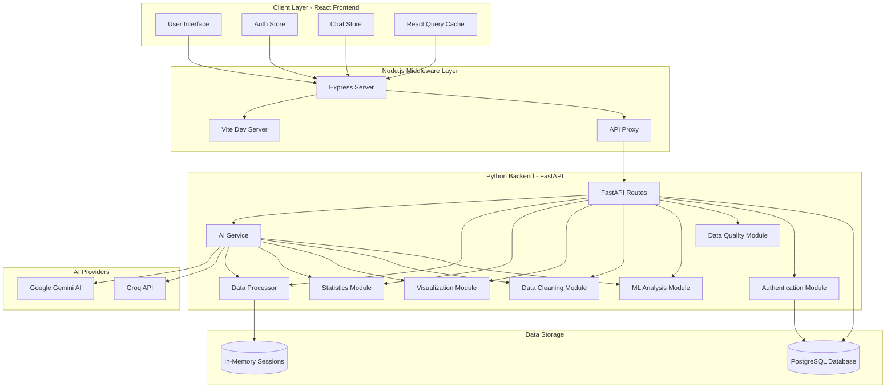
```mermaid
graph TB
    subgraph "Client Layer - React Frontend"
        UI[User Interface]
        Auth[Auth Store]
        Chat[Chat Store]
        Query[React Query Cache]
    end
    
    subgraph "Node.js Middleware Layer"
        Express[Express Server]
        Vite[Vite Dev Server]
        Proxy[API Proxy]
    end
    
    subgraph "Python Backend - FastAPI"
        API[FastAPI Routes]
        AIService[AI Service]
        DataProc[Data Processor]
        Stats[Statistics Module]
        Viz[Visualization Module]
        Clean[Data Cleaning Module]
        ML[ML Analysis Module]
        Quality[Data Quality Module]
        AuthModule[Authentication Module]
    end
    
    subgraph "AI Providers"
        Gemini[Google Gemini AI]
        Groq[Groq API]
    end
    
    subgraph "Data Storage"
        Postgres[(PostgreSQL Database)]
        Memory[(In-Memory Sessions)]
    end
    
    UI --> Express
    Auth --> Express
    Chat --> Express
    Query --> Express
    
    Express --> Vite
    Express --> Proxy
    Proxy --> API
    
    API --> AIService
    API --> DataProc
    API --> Stats
    API --> Viz
    API --> Clean
    API --> ML
    API --> Quality
    API --> AuthModule
    
    AIService --> Gemini
    AIService --> Groq
    
    DataProc --> Memory
    AuthModule --> Postgres
    API --> Postgres
    
    AIService --> DataProc
    AIService --> Stats
    AIService --> Viz
    AIService --> Clean
    AIService --> ML
```

---

## 2. Technology Stack

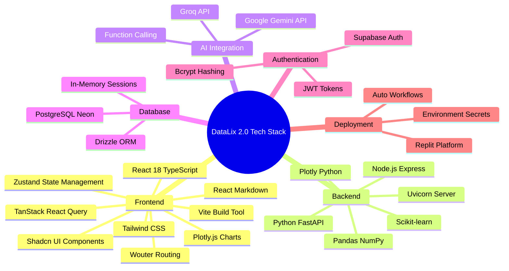
```mermaid
mindmap
  root((DataLix 2.0 Tech Stack))
    Frontend
      React 18 TypeScript
      Vite Build Tool
      Wouter Routing
      Zustand State Management
      TanStack React Query
      Shadcn UI Components
      Tailwind CSS
      Plotly.js Charts
      React Markdown
    Backend
      Python FastAPI
      Node.js Express
      Pandas NumPy
      Scikit-learn
      Plotly Python
      Uvicorn Server
    AI Integration
      Google Gemini API
      Groq API
      Function Calling
    Database
      PostgreSQL Neon
      Drizzle ORM
      In-Memory Sessions
    Authentication
      Supabase Auth
      JWT Tokens
      Bcrypt Hashing
    Deployment
      Replit Platform
      Environment Secrets
      Auto Workflows
```

---

## 3. User Flow - Complete Journey

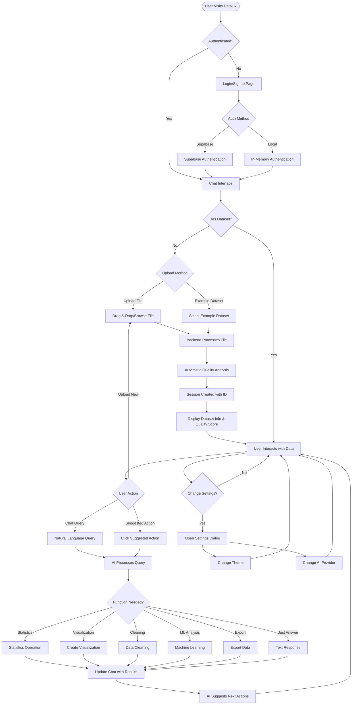
```mermaid
flowchart TD
    Start([User Visits DataLix]) --> CheckAuth{Authenticated?}
    
    CheckAuth -->|No| Login[Login/Signup Page]
    CheckAuth -->|Yes| ChatPage[Chat Interface]
    
    Login --> AuthChoice{Auth Method}
    AuthChoice -->|Supabase| SupaAuth[Supabase Authentication]
    AuthChoice -->|Local| LocalAuth[In-Memory Authentication]
    
    SupaAuth --> ChatPage
    LocalAuth --> ChatPage
    
    ChatPage --> HasDataset{Has Dataset?}
    
    HasDataset -->|No| UploadOptions{Upload Method}
    UploadOptions -->|Upload File| FileUpload[Drag & Drop/Browse File]
    UploadOptions -->|Example Dataset| ExampleData[Select Example Dataset]
    
    FileUpload --> ProcessFile[Backend Processes File]
    ExampleData --> ProcessFile
    
    ProcessFile --> QualityAnalysis[Automatic Quality Analysis]
    QualityAnalysis --> SessionCreated[Session Created with ID]
    SessionCreated --> ShowResults[Display Dataset Info & Quality Score]
    
    ShowResults --> InteractData[User Interacts with Data]
    
    HasDataset -->|Yes| InteractData
    
    InteractData --> UserAction{User Action}
    
    UserAction -->|Chat Query| NLQuery[Natural Language Query]
    UserAction -->|Suggested Action| QuickAction[Click Suggested Action]
    UserAction -->|Upload New| FileUpload
    
    NLQuery --> AIProcess[AI Processes Query]
    QuickAction --> AIProcess
    
    AIProcess --> FunctionCall{Function Needed?}
    
    FunctionCall -->|Statistics| StatsOp[Statistics Operation]
    FunctionCall -->|Visualization| VizOp[Create Visualization]
    FunctionCall -->|Cleaning| CleanOp[Data Cleaning]
    FunctionCall -->|ML Analysis| MLOp[Machine Learning]
    FunctionCall -->|Export| ExportOp[Export Data]
    FunctionCall -->|Just Answer| TextResp[Text Response]
    
    StatsOp --> UpdateChat[Update Chat with Results]
    VizOp --> UpdateChat
    CleanOp --> UpdateChat
    MLOp --> UpdateChat
    ExportOp --> UpdateChat
    TextResp --> UpdateChat
    
    UpdateChat --> SuggestActions[AI Suggests Next Actions]
    SuggestActions --> InteractData
    
    InteractData --> Settings{Change Settings?}
    Settings -->|Yes| SettingsDialog[Open Settings Dialog]
    SettingsDialog --> ThemeChange[Change Theme]
    SettingsDialog --> ProviderChange[Change AI Provider]
    ThemeChange --> InteractData
    ProviderChange --> InteractData
    Settings -->|No| InteractData
```

---

## 4. Data Processing Pipeline

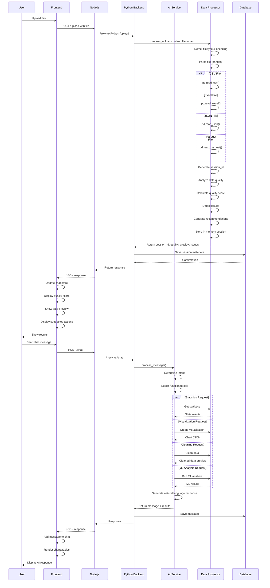
```mermaid
sequenceDiagram
    participant U as User
    participant F as Frontend
    participant N as Node.js
    participant P as Python Backend
    participant AI as AI Service
    participant DP as Data Processor
    participant DB as Database
    
    U->>F: Upload File
    F->>N: POST /upload with file
    N->>P: Proxy to Python /upload
    
    P->>DP: process_upload(content, filename)
    DP->>DP: Detect file type & encoding
    DP->>DP: Parse file (pandas)
    
    alt CSV File
        DP->>DP: pd.read_csv()
    else Excel File
        DP->>DP: pd.read_excel()
    else JSON File
        DP->>DP: pd.read_json()
    else Parquet File
        DP->>DP: pd.read_parquet()
    end
    
    DP->>DP: Generate session_id
    DP->>DP: Analyze data quality
    DP->>DP: Calculate quality score
    DP->>DP: Detect issues
    DP->>DP: Generate recommendations
    DP->>DP: Store in memory session
    
    DP-->>P: Return session_id, quality, preview, issues
    
    P->>DB: Save session metadata
    DB-->>P: Confirmation
    
    P-->>N: Return response
    N-->>F: JSON response
    F->>F: Update chat store
    F->>F: Display quality score
    F->>F: Show data preview
    F->>F: Display suggested actions
    F-->>U: Show results
    
    U->>F: Send chat message
    F->>N: POST /chat
    N->>P: Proxy to /chat
    P->>AI: process_message()
    
    AI->>AI: Determine intent
    AI->>AI: Select function to call
    
    alt Statistics Request
        AI->>DP: Get statistics
        DP-->>AI: Stats results
    else Visualization Request
        AI->>DP: Create visualization
        DP-->>AI: Chart JSON
    else Cleaning Request
        AI->>DP: Clean data
        DP-->>AI: Cleaned data preview
    else ML Analysis Request
        AI->>DP: Run ML analysis
        DP-->>AI: ML results
    end
    
    AI->>AI: Generate natural language response
    AI-->>P: Return message + results
    
    P->>DB: Save message
    P-->>N: Response
    N-->>F: JSON response
    F->>F: Add message to chat
    F->>F: Render charts/tables
    F-->>U: Display AI response
```

---

## 5. AI Integration Architecture

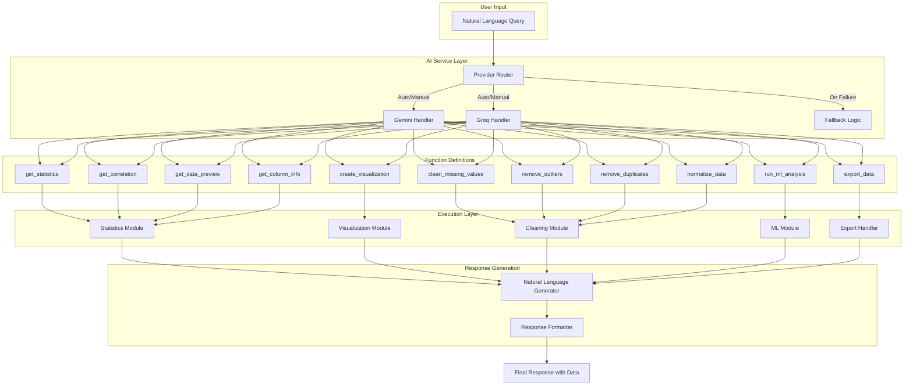
```mermaid
graph TB
    subgraph "User Input"
        Query[Natural Language Query]
    end
    
    subgraph "AI Service Layer"
        Router[Provider Router]
        Gemini[Gemini Handler]
        Groq[Groq Handler]
        FallBack[Fallback Logic]
    end
    
    subgraph "Function Definitions"
        F1[get_statistics]
        F2[get_correlation]
        F3[create_visualization]
        F4[clean_missing_values]
        F5[remove_outliers]
        F6[remove_duplicates]
        F7[normalize_data]
        F8[run_ml_analysis]
        F9[export_data]
        F10[get_data_preview]
        F11[get_column_info]
    end
    
    subgraph "Execution Layer"
        Stats[Statistics Module]
        Viz[Visualization Module]
        Clean[Cleaning Module]
        ML[ML Module]
        Export[Export Handler]
    end
    
    subgraph "Response Generation"
        NLG[Natural Language Generator]
        Format[Response Formatter]
    end
    
    Query --> Router
    
    Router -->|Auto/Manual| Gemini
    Router -->|Auto/Manual| Groq
    Router -->|On Failure| FallBack
    
    Gemini --> F1
    Gemini --> F2
    Gemini --> F3
    Gemini --> F4
    Gemini --> F5
    Gemini --> F6
    Gemini --> F7
    Gemini --> F8
    Gemini --> F9
    Gemini --> F10
    Gemini --> F11
    
    Groq --> F1
    Groq --> F2
    Groq --> F3
    Groq --> F4
    Groq --> F5
    Groq --> F6
    Groq --> F7
    Groq --> F8
    Groq --> F9
    Groq --> F10
    Groq --> F11
    
    F1 --> Stats
    F2 --> Stats
    F3 --> Viz
    F4 --> Clean
    F5 --> Clean
    F6 --> Clean
    F7 --> Clean
    F8 --> ML
    F9 --> Export
    F10 --> Stats
    F11 --> Stats
    
    Stats --> NLG
    Viz --> NLG
    Clean --> NLG
    ML --> NLG
    Export --> NLG
    
    NLG --> Format
    Format --> Response[Final Response with Data]
```

---

## 6. Data Quality Scoring System

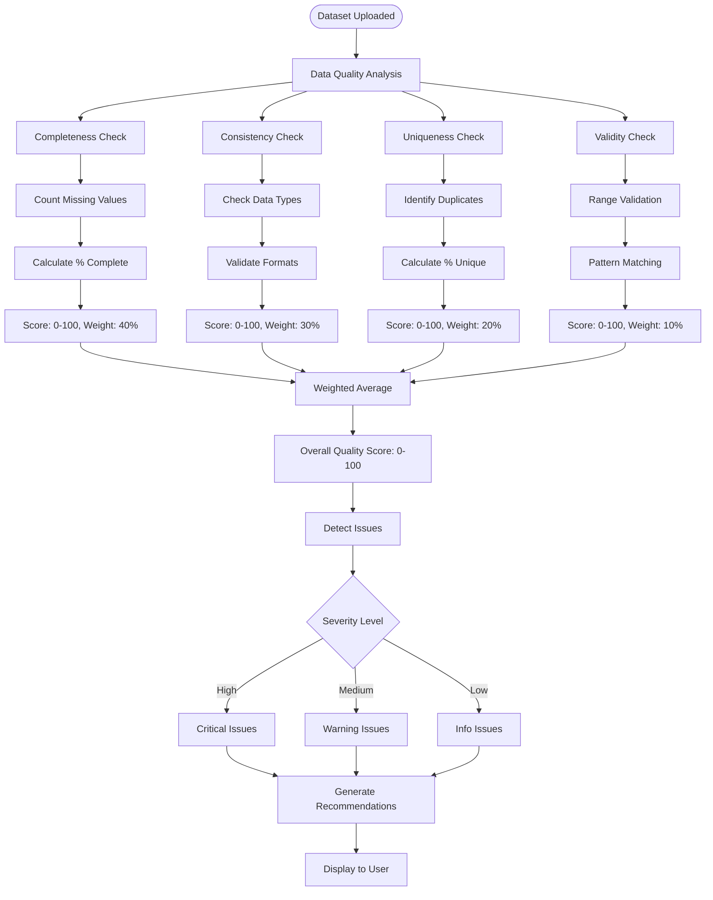
```mermaid
flowchart TD
    Start([Dataset Uploaded]) --> Analyze[Data Quality Analysis]
    
    Analyze --> Completeness[Completeness Check]
    Analyze --> Consistency[Consistency Check]
    Analyze --> Uniqueness[Uniqueness Check]
    Analyze --> Validity[Validity Check]
    
    Completeness --> C1[Count Missing Values]
    C1 --> C2[Calculate % Complete]
    C2 --> C3[Score: 0-100, Weight: 40%]
    
    Consistency --> CS1[Check Data Types]
    CS1 --> CS2[Validate Formats]
    CS2 --> CS3[Score: 0-100, Weight: 30%]
    
    Uniqueness --> U1[Identify Duplicates]
    U1 --> U2[Calculate % Unique]
    U2 --> U3[Score: 0-100, Weight: 20%]
    
    Validity --> V1[Range Validation]
    V1 --> V2[Pattern Matching]
    V2 --> V3[Score: 0-100, Weight: 10%]
    
    C3 --> Weighted[Weighted Average]
    CS3 --> Weighted
    U3 --> Weighted
    V3 --> Weighted
    
    Weighted --> Overall[Overall Quality Score: 0-100]
    
    Overall --> Issues[Detect Issues]
    Issues --> Severity{Severity Level}
    
    Severity -->|High| Critical[Critical Issues]
    Severity -->|Medium| Warning[Warning Issues]
    Severity -->|Low| Info[Info Issues]
    
    Critical --> Recommend[Generate Recommendations]
    Warning --> Recommend
    Info --> Recommend
    
    Recommend --> Display[Display to User]
```

---

## 7. Database Schema

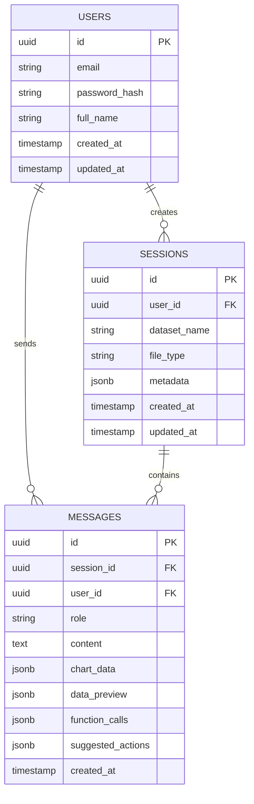
```mermaid
erDiagram
    USERS ||--o{ SESSIONS : creates
    USERS ||--o{ MESSAGES : sends
    SESSIONS ||--o{ MESSAGES : contains
    
    USERS {
        uuid id PK
        string email
        string password_hash
        string full_name
        timestamp created_at
        timestamp updated_at
    }
    
    SESSIONS {
        uuid id PK
        uuid user_id FK
        string dataset_name
        string file_type
        jsonb metadata
        timestamp created_at
        timestamp updated_at
    }
    
    MESSAGES {
        uuid id PK
        uuid session_id FK
        uuid user_id FK
        string role
        text content
        jsonb chart_data
        jsonb data_preview
        jsonb function_calls
        jsonb suggested_actions
        timestamp created_at
    }
```

---

## 8. Frontend Component Hierarchy

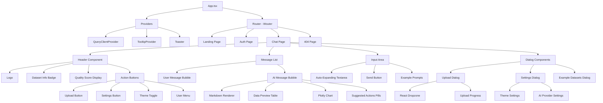
```mermaid
graph TB
    App[App.tsx] --> Provider[Providers]
    
    Provider --> QueryProvider[QueryClientProvider]
    Provider --> TooltipProvider[TooltipProvider]
    Provider --> Toaster[Toaster]
    
    App --> Router[Router - Wouter]
    
    Router --> Landing[Landing Page]
    Router --> Auth[Auth Page]
    Router --> Chat[Chat Page]
    Router --> NotFound[404 Page]
    
    Chat --> Header[Header Component]
    Chat --> Messages[Message List]
    Chat --> Input[Input Area]
    
    Header --> Logo[Logo]
    Header --> DatasetInfo[Dataset Info Badge]
    Header --> QualityScore[Quality Score Display]
    Header --> Actions[Action Buttons]
    
    Actions --> UploadBtn[Upload Button]
    Actions --> SettingsBtn[Settings Button]
    Actions --> ThemeToggle[Theme Toggle]
    Actions --> UserMenu[User Menu]
    
    Messages --> UserMsg[User Message Bubble]
    Messages --> AIMsg[AI Message Bubble]
    
    AIMsg --> Markdown[Markdown Renderer]
    AIMsg --> DataTable[Data Preview Table]
    AIMsg --> Chart[Plotly Chart]
    AIMsg --> SuggestedActions[Suggested Actions Pills]
    
    Input --> Textarea[Auto-Expanding Textarea]
    Input --> SendBtn[Send Button]
    Input --> Examples[Example Prompts]
    
    Chat --> Dialogs[Dialog Components]
    Dialogs --> UploadDialog[Upload Dialog]
    Dialogs --> SettingsDialog[Settings Dialog]
    Dialogs --> ExampleDialog[Example Datasets Dialog]
    
    UploadDialog --> Dropzone[React Dropzone]
    UploadDialog --> Progress[Upload Progress]
    
    SettingsDialog --> ThemeSettings[Theme Settings]
    SettingsDialog --> AISettings[AI Provider Settings]
```

---

## 9. State Management Flow

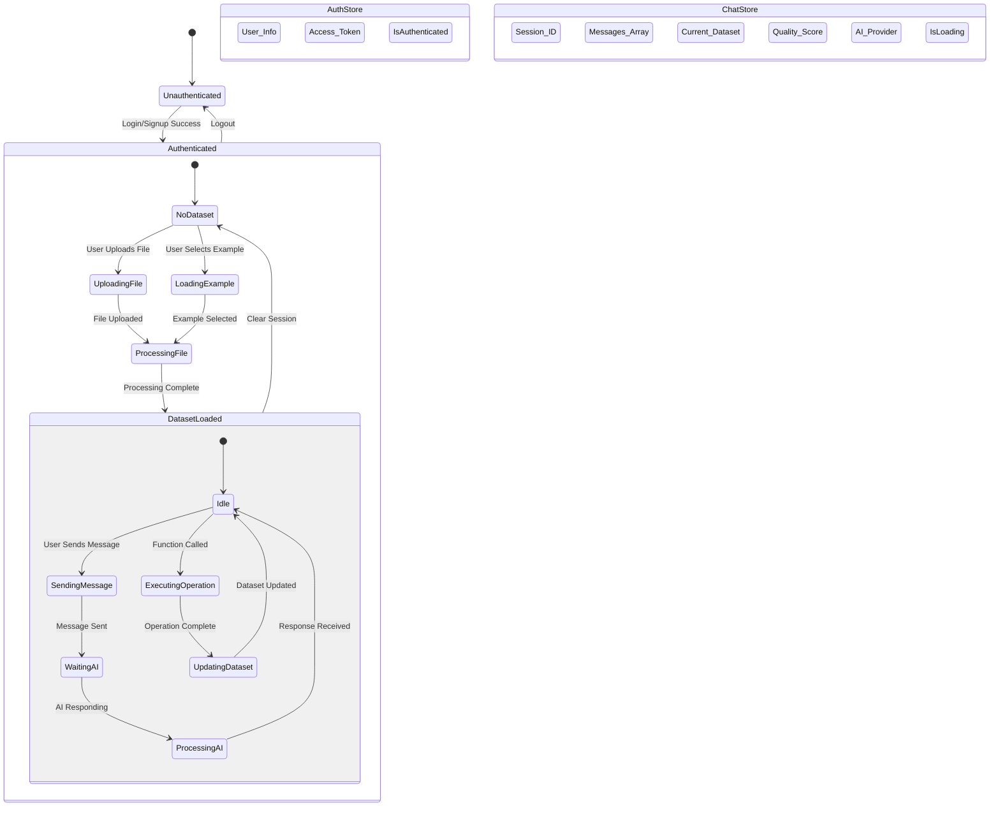
```mermaid
stateDiagram-v2
    [*] --> Unauthenticated
    
    Unauthenticated --> Authenticated: Login/Signup Success
    Authenticated --> Unauthenticated: Logout
    
    state Authenticated {
        [*] --> NoDataset
        
        NoDataset --> UploadingFile: User Uploads File
        NoDataset --> LoadingExample: User Selects Example
        
        UploadingFile --> ProcessingFile: File Uploaded
        LoadingExample --> ProcessingFile: Example Selected
        
        ProcessingFile --> DatasetLoaded: Processing Complete
        
        state DatasetLoaded {
            [*] --> Idle
            
            Idle --> SendingMessage: User Sends Message
            SendingMessage --> WaitingAI: Message Sent
            WaitingAI --> ProcessingAI: AI Responding
            ProcessingAI --> Idle: Response Received
            
            Idle --> ExecutingOperation: Function Called
            ExecutingOperation --> UpdatingDataset: Operation Complete
            UpdatingDataset --> Idle: Dataset Updated
        }
        
        DatasetLoaded --> NoDataset: Clear Session
    }
    
    state AuthStore {
        User_Info
        Access_Token
        IsAuthenticated
    }
    
    state ChatStore {
        Session_ID
        Messages_Array
        Current_Dataset
        Quality_Score
        AI_Provider
        IsLoading
    }
```

---

## 10. Machine Learning Capabilities

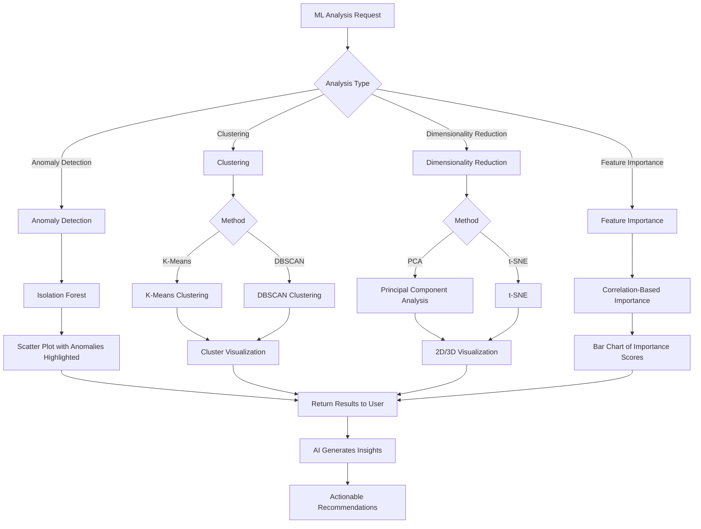
```mermaid
graph TB
    MLRequest[ML Analysis Request] --> Type{Analysis Type}
    
    Type -->|Anomaly Detection| Anomaly[Anomaly Detection]
    Type -->|Clustering| Cluster[Clustering]
    Type -->|Dimensionality Reduction| DimRed[Dimensionality Reduction]
    Type -->|Feature Importance| FeatImp[Feature Importance]
    
    Anomaly --> IsoForest[Isolation Forest]
    IsoForest --> AnomalyViz[Scatter Plot with Anomalies Highlighted]
    
    Cluster --> ClusterType{Method}
    ClusterType -->|K-Means| KMeans[K-Means Clustering]
    ClusterType -->|DBSCAN| DBSCAN[DBSCAN Clustering]
    KMeans --> ClusterViz[Cluster Visualization]
    DBSCAN --> ClusterViz
    
    DimRed --> DimType{Method}
    DimType -->|PCA| PCA[Principal Component Analysis]
    DimType -->|t-SNE| TSNE[t-SNE]
    PCA --> DimViz[2D/3D Visualization]
    TSNE --> DimViz
    
    FeatImp --> Correlation[Correlation-Based Importance]
    Correlation --> ImpViz[Bar Chart of Importance Scores]
    
    AnomalyViz --> Results[Return Results to User]
    ClusterViz --> Results
    DimViz --> Results
    ImpViz --> Results
    
    Results --> Insights[AI Generates Insights]
    Insights --> Recommendations[Actionable Recommendations]
```

---

## 11. Data Cleaning Workflow

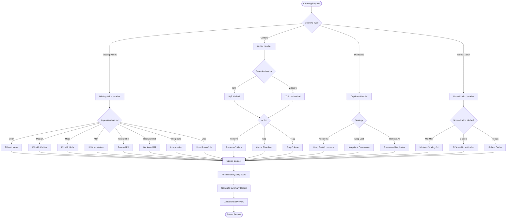
```mermaid
flowchart TD
    Start([Cleaning Request]) --> Type{Cleaning Type}
    
    Type -->|Missing Values| MissingFlow[Missing Value Handler]
    Type -->|Outliers| OutlierFlow[Outlier Handler]
    Type -->|Duplicates| DuplicateFlow[Duplicate Handler]
    Type -->|Normalization| NormalizeFlow[Normalization Handler]
    
    MissingFlow --> MissingMethod{Imputation Method}
    MissingMethod -->|Mean| Mean[Fill with Mean]
    MissingMethod -->|Median| Median[Fill with Median]
    MissingMethod -->|Mode| Mode[Fill with Mode]
    MissingMethod -->|KNN| KNN[KNN Imputation]
    MissingMethod -->|Forward Fill| FFill[Forward Fill]
    MissingMethod -->|Backward Fill| BFill[Backward Fill]
    MissingMethod -->|Interpolate| Interp[Interpolation]
    MissingMethod -->|Drop| Drop[Drop Rows/Cols]
    
    OutlierFlow --> OutlierMethod{Detection Method}
    OutlierMethod -->|IQR| IQR[IQR Method]
    OutlierMethod -->|Z-Score| ZScore[Z-Score Method]
    
    IQR --> OutlierAction{Action}
    ZScore --> OutlierAction
    OutlierAction -->|Remove| RemoveOut[Remove Outliers]
    OutlierAction -->|Cap| CapOut[Cap at Threshold]
    OutlierAction -->|Flag| FlagOut[Flag Column]
    
    DuplicateFlow --> DupStrategy{Strategy}
    DupStrategy -->|Keep First| KeepFirst[Keep First Occurrence]
    DupStrategy -->|Keep Last| KeepLast[Keep Last Occurrence]
    DupStrategy -->|Remove All| RemoveAll[Remove All Duplicates]
    
    NormalizeFlow --> NormMethod{Normalization Method}
    NormMethod -->|Min-Max| MinMax[Min-Max Scaling 0-1]
    NormMethod -->|Z-Score| ZNorm[Z-Score Normalization]
    NormMethod -->|Robust| Robust[Robust Scaler]
    
    Mean --> Update[Update Dataset]
    Median --> Update
    Mode --> Update
    KNN --> Update
    FFill --> Update
    BFill --> Update
    Interp --> Update
    Drop --> Update
    RemoveOut --> Update
    CapOut --> Update
    FlagOut --> Update
    KeepFirst --> Update
    KeepLast --> Update
    RemoveAll --> Update
    MinMax --> Update
    ZNorm --> Update
    Robust --> Update
    
    Update --> Recalc[Recalculate Quality Score]
    Recalc --> Summary[Generate Summary Report]
    Summary --> Preview[Update Data Preview]
    Preview --> End([Return Results])
```

---

## 12. Visualization Types & Use Cases

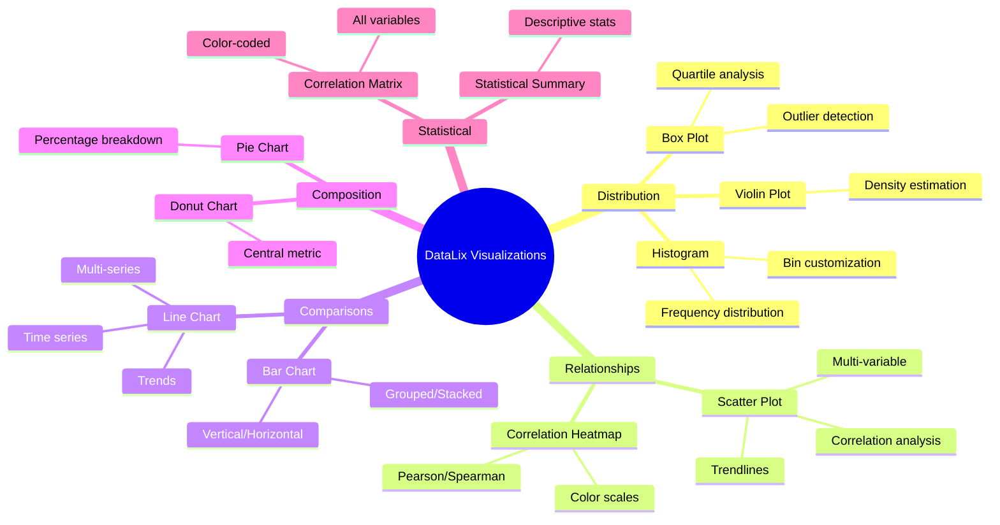
```mermaid
mindmap
  root((DataLix Visualizations))
    Distribution
      Histogram
        Frequency distribution
        Bin customization
      Box Plot
        Quartile analysis
        Outlier detection
      Violin Plot
        Density estimation
    Relationships
      Scatter Plot
        Correlation analysis
        Trendlines
        Multi-variable
      Correlation Heatmap
        Pearson/Spearman
        Color scales
    Comparisons
      Bar Chart
        Vertical/Horizontal
        Grouped/Stacked
      Line Chart
        Time series
        Multi-series
        Trends
    Composition
      Pie Chart
        Percentage breakdown
      Donut Chart
        Central metric
    Statistical
      Correlation Matrix
        All variables
        Color-coded
      Statistical Summary
        Descriptive stats
```

---

## 13. Authentication Flow

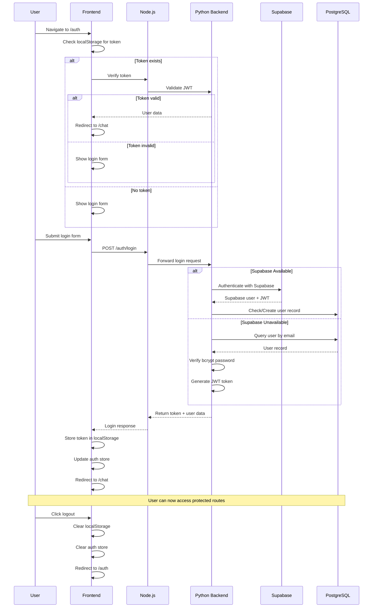
```mermaid
sequenceDiagram
    participant U as User
    participant F as Frontend
    participant N as Node.js
    participant P as Python Backend
    participant S as Supabase
    participant DB as PostgreSQL
    
    U->>F: Navigate to /auth
    F->>F: Check localStorage for token
    
    alt Token exists
        F->>N: Verify token
        N->>P: Validate JWT
        alt Token valid
            P-->>F: User data
            F->>F: Redirect to /chat
        else Token invalid
            F->>F: Show login form
        end
    else No token
        F->>F: Show login form
    end
    
    U->>F: Submit login form
    F->>N: POST /auth/login
    N->>P: Forward login request
    
    alt Supabase Available
        P->>S: Authenticate with Supabase
        S-->>P: Supabase user + JWT
        P->>DB: Check/Create user record
    else Supabase Unavailable
        P->>DB: Query user by email
        DB-->>P: User record
        P->>P: Verify bcrypt password
        P->>P: Generate JWT token
    end
    
    P-->>N: Return token + user data
    N-->>F: Login response
    F->>F: Store token in localStorage
    F->>F: Update auth store
    F->>F: Redirect to /chat
    
    Note over U,DB: User can now access protected routes
    
    U->>F: Click logout
    F->>F: Clear localStorage
    F->>F: Clear auth store
    F->>F: Redirect to /auth
```

---

## 14. File Upload & Processing

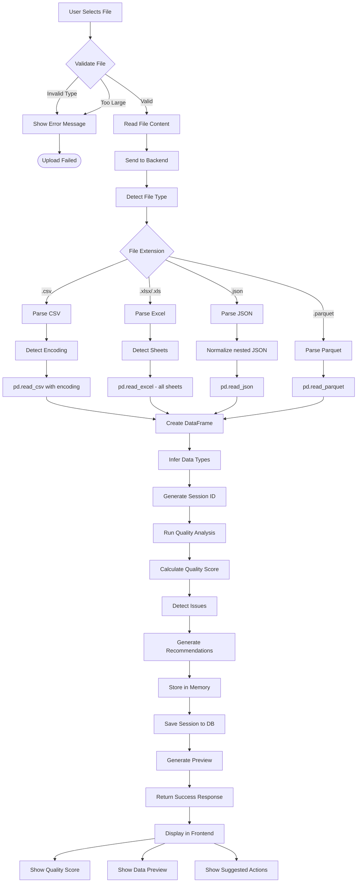
```mermaid
flowchart TD
    UserSelect[User Selects File] --> Validate{Validate File}
    
    Validate -->|Invalid Type| Error[Show Error Message]
    Validate -->|Too Large| Error
    Validate -->|Valid| ReadFile[Read File Content]
    
    Error --> End([Upload Failed])
    
    ReadFile --> SendServer[Send to Backend]
    SendServer --> DetectType[Detect File Type]
    
    DetectType --> FileType{File Extension}
    
    FileType -->|.csv| ParseCSV[Parse CSV]
    FileType -->|.xlsx/.xls| ParseExcel[Parse Excel]
    FileType -->|.json| ParseJSON[Parse JSON]
    FileType -->|.parquet| ParseParquet[Parse Parquet]
    
    ParseCSV --> Encoding[Detect Encoding]
    Encoding --> CSVRead[pd.read_csv with encoding]
    
    ParseExcel --> SheetDetect[Detect Sheets]
    SheetDetect --> ExcelRead[pd.read_excel - all sheets]
    
    ParseJSON --> JSONNormalize[Normalize nested JSON]
    JSONNormalize --> JSONRead[pd.read_json]
    
    ParseParquet --> ParquetRead[pd.read_parquet]
    
    CSVRead --> DataFrame[Create DataFrame]
    ExcelRead --> DataFrame
    JSONRead --> DataFrame
    ParquetRead --> DataFrame
    
    DataFrame --> Infer[Infer Data Types]
    Infer --> GenerateID[Generate Session ID]
    
    GenerateID --> Quality[Run Quality Analysis]
    Quality --> Calculate[Calculate Quality Score]
    Calculate --> DetectIssues[Detect Issues]
    DetectIssues --> GenRecommend[Generate Recommendations]
    
    GenRecommend --> StoreMemory[Store in Memory]
    StoreMemory --> StoreDB[Save Session to DB]
    
    StoreDB --> Preview[Generate Preview]
    Preview --> Success[Return Success Response]
    
    Success --> Display[Display in Frontend]
    Display --> ShowQuality[Show Quality Score]
    Display --> ShowPreview[Show Data Preview]
    Display --> ShowActions[Show Suggested Actions]
```

---

## 15. Feature Implementation Status

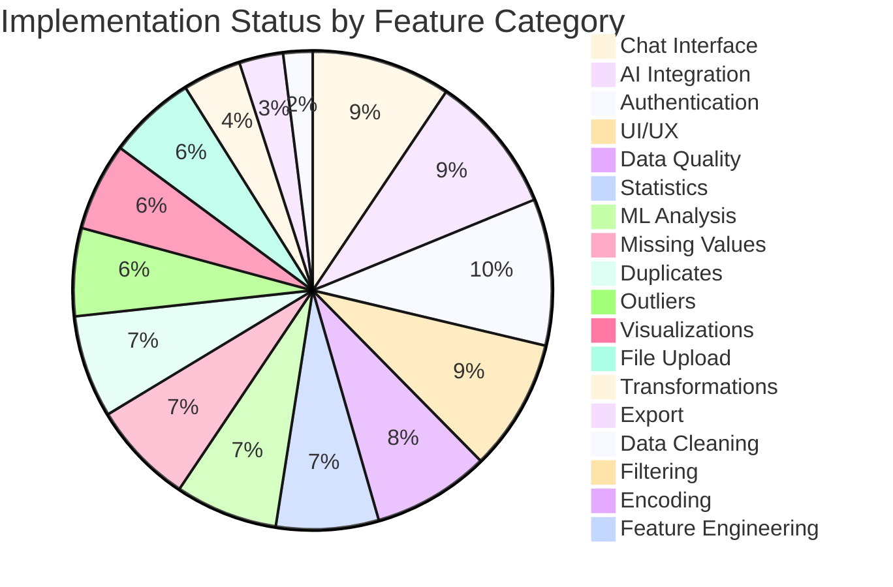
```mermaid
%%{init: {'theme':'base'}}%%
pie title Implementation Status by Feature Category
    "Chat Interface" : 95
    "AI Integration" : 95
    "Authentication" : 100
    "UI/UX" : 90
    "Data Quality" : 80
    "Statistics" : 70
    "ML Analysis" : 70
    "Missing Values" : 70
    "Duplicates" : 70
    "Outliers" : 60
    "Visualizations" : 60
    "File Upload" : 60
    "Transformations" : 40
    "Export" : 30
    "Data Cleaning" : 20
    "Filtering" : 10
    "Encoding" : 0
    "Feature Engineering" : 0
```

---

## 16. Backend Module Dependencies

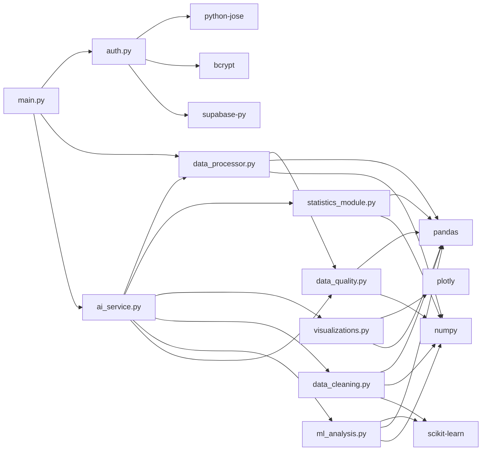
```mermaid
graph LR
    Main[main.py] --> Auth[auth.py]
    Main --> DataProc[data_processor.py]
    Main --> AIService[ai_service.py]
    
    AIService --> DataProc
    AIService --> Stats[statistics_module.py]
    AIService --> Viz[visualizations.py]
    AIService --> Clean[data_cleaning.py]
    AIService --> ML[ml_analysis.py]
    AIService --> Quality[data_quality.py]
    
    DataProc --> Quality
    DataProc --> Pandas[pandas]
    DataProc --> NumPy[numpy]
    
    Stats --> Pandas
    Stats --> NumPy
    
    Viz --> Plotly[plotly]
    Viz --> Pandas
    
    Clean --> Pandas
    Clean --> NumPy
    Clean --> SKLearn[scikit-learn]
    
    ML --> SKLearn
    ML --> Pandas
    ML --> NumPy
    
    Quality --> Pandas
    Quality --> NumPy
    
    Auth --> JWT[python-jose]
    Auth --> Bcrypt[bcrypt]
    Auth --> Supabase[supabase-py]
```

---

## 17. Deployment Architecture

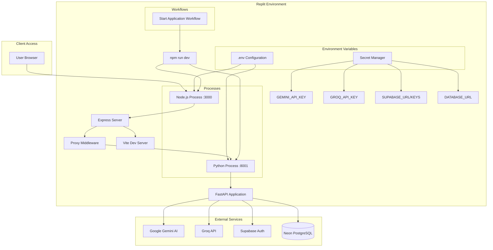
```mermaid
graph TB
    subgraph "Replit Environment"
        subgraph "Workflows"
            Start[Start Application Workflow]
        end
        
        subgraph "Processes"
            Node[Node.js Process :3000]
            Python[Python Process :8001]
        end
        
        subgraph "Environment Variables"
            Secrets[Secret Manager]
            Env[.env Configuration]
        end
        
        Start --> NPMDev[npm run dev]
        NPMDev --> Node
        NPMDev --> Python
        
        Node --> Express[Express Server]
        Express --> Vite[Vite Dev Server]
        Express --> Proxy[Proxy Middleware]
        
        Proxy --> Python
        Python --> FastAPI[FastAPI Application]
        
        Secrets --> Gemini[GEMINI_API_KEY]
        Secrets --> Groq[GROQ_API_KEY]
        Secrets --> Supa[SUPABASE_URL/KEYS]
        Secrets --> DB[DATABASE_URL]
        
        Env --> Node
        Env --> Python
    end
    
    subgraph "External Services"
        GeminiAPI[Google Gemini AI]
        GroqAPI[Groq API]
        SupabaseAuth[Supabase Auth]
        PostgresDB[(Neon PostgreSQL)]
    end
    
    FastAPI --> GeminiAPI
    FastAPI --> GroqAPI
    FastAPI --> SupabaseAuth
    FastAPI --> PostgresDB
    
    subgraph "Client Access"
        Browser[User Browser]
    end
    
    Browser --> Node
```

---

## 18. Conversation Context Management

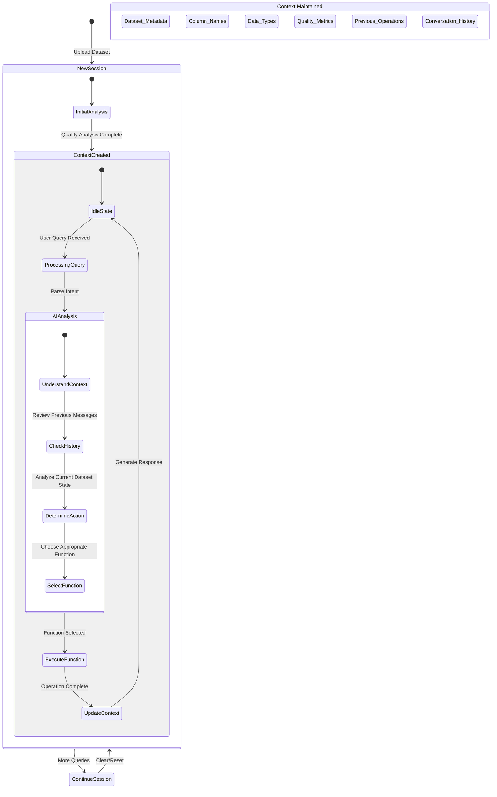
```mermaid
stateDiagram-v2
    [*] --> NewSession: Upload Dataset
    
    state NewSession {
        [*] --> InitialAnalysis
        InitialAnalysis --> ContextCreated: Quality Analysis Complete
        
        state ContextCreated {
            [*] --> IdleState
            
            IdleState --> ProcessingQuery: User Query Received
            ProcessingQuery --> AIAnalysis: Parse Intent
            
            state AIAnalysis {
                [*] --> UnderstandContext
                UnderstandContext --> CheckHistory: Review Previous Messages
                CheckHistory --> DetermineAction: Analyze Current Dataset State
                DetermineAction --> SelectFunction: Choose Appropriate Function
            }
            
            AIAnalysis --> ExecuteFunction: Function Selected
            ExecuteFunction --> UpdateContext: Operation Complete
            UpdateContext --> IdleState: Generate Response
        }
    }
    
    NewSession --> ContinueSession: More Queries
    ContinueSession --> NewSession: Clear/Reset
    
    state "Context Maintained" as Context {
        Dataset_Metadata
        Column_Names
        Data_Types
        Quality_Metrics
        Previous_Operations
        Conversation_History
    }
```

---

## 19. Error Handling Strategy

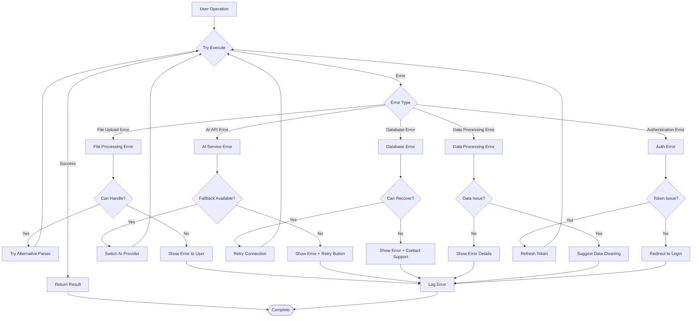
```mermaid
flowchart TD
    Operation[User Operation] --> Try{Try Execute}
    
    Try -->|Success| Success[Return Result]
    Try -->|Error| ErrorType{Error Type}
    
    ErrorType -->|File Upload Error| FileError[File Processing Error]
    ErrorType -->|AI API Error| AIError[AI Service Error]
    ErrorType -->|Database Error| DBError[Database Error]
    ErrorType -->|Data Processing Error| DataError[Data Processing Error]
    ErrorType -->|Authentication Error| AuthError[Auth Error]
    
    FileError --> FileHandle{Can Handle?}
    FileHandle -->|Yes| Retry1[Try Alternative Parser]
    FileHandle -->|No| UserError1[Show Error to User]
    
    AIError --> AIHandle{Fallback Available?}
    AIHandle -->|Yes| SwitchProvider[Switch AI Provider]
    AIHandle -->|No| UserError2[Show Error + Retry Button]
    
    DBError --> DBHandle{Can Recover?}
    DBHandle -->|Yes| RetryDB[Retry Connection]
    DBHandle -->|No| UserError3[Show Error + Contact Support]
    
    DataError --> DataHandle{Data Issue?}
    DataHandle -->|Yes| SuggestClean[Suggest Data Cleaning]
    DataHandle -->|No| UserError4[Show Error Details]
    
    AuthError --> AuthHandle{Token Issue?}
    AuthHandle -->|Yes| RefreshToken[Refresh Token]
    AuthHandle -->|No| ForceLogin[Redirect to Login]
    
    Retry1 --> Try
    SwitchProvider --> Try
    RetryDB --> Try
    RefreshToken --> Try
    
    UserError1 --> Log[Log Error]
    UserError2 --> Log
    UserError3 --> Log
    UserError4 --> Log
    SuggestClean --> Log
    ForceLogin --> Log
    
    Success --> End([Complete])
    Log --> End
```

---

## 20. Security Architecture

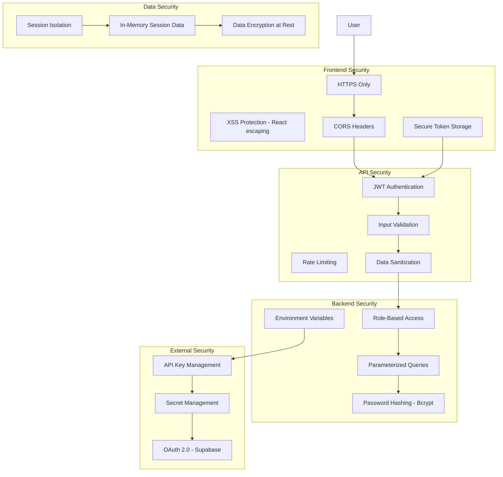
```mermaid
graph TB
    subgraph "Frontend Security"
        XSS[XSS Protection - React escaping]
        HTTPS[HTTPS Only]
        TokenStorage[Secure Token Storage]
        CORS[CORS Headers]
    end
    
    subgraph "API Security"
        JWT[JWT Authentication]
        RateLimit[Rate Limiting]
        Validation[Input Validation]
        Sanitize[Data Sanitization]
    end
    
    subgraph "Backend Security"
        Bcrypt[Password Hashing - Bcrypt]
        EnvVars[Environment Variables]
        DBSec[Parameterized Queries]
        RoleBased[Role-Based Access]
    end
    
    subgraph "Data Security"
        Session[Session Isolation]
        Memory[In-Memory Session Data]
        Encryption[Data Encryption at Rest]
    end
    
    subgraph "External Security"
        APIKeys[API Key Management]
        Secrets[Secret Management]
        OAuth[OAuth 2.0 - Supabase]
    end
    
    User[User] --> HTTPS
    HTTPS --> CORS
    CORS --> JWT
    JWT --> Validation
    Validation --> Sanitize
    
    Sanitize --> RoleBased
    RoleBased --> DBSec
    DBSec --> Bcrypt
    
    TokenStorage --> JWT
    EnvVars --> APIKeys
    APIKeys --> Secrets
    Secrets --> OAuth
    
    Session --> Memory
    Memory --> Encryption
```

---

## Appendix: Quick Reference

### AI Function Catalog
| Function Name | Purpose | Returns |
|--------------|---------|---------|
| get_statistics | Descriptive statistics | Mean, median, std, quartiles |
| get_correlation | Correlation analysis | Correlation matrix |
| create_visualization | Generate charts | Plotly JSON |
| clean_missing_values | Handle missing data | Cleaned dataset |
| remove_outliers | Outlier removal | Cleaned dataset |
| remove_duplicates | Duplicate removal | Deduplicated dataset |
| normalize_data | Data normalization | Normalized dataset |
| run_ml_analysis | ML operations | Clustering, PCA, anomalies |
| export_data | Export to file | Download link |
| get_data_preview | View dataset | Table preview |
| get_column_info | Column details | Data types, stats |

### Supported File Formats
- **CSV**: Auto-encoding detection
- **Excel**: Multi-sheet support (.xlsx, .xls)
- **JSON**: Nested/flat structure
- **Parquet**: Optimized columnar format

### Quality Score Components
1. **Completeness (40%)**: Missing value ratio
2. **Consistency (30%)**: Data type uniformity
3. **Uniqueness (20%)**: Duplicate ratio
4. **Validity (10%)**: Format/range validation

### Tech Stack Versions
- React: 18+
- TypeScript: Latest
- Python: 3.11
- FastAPI: Latest
- Node.js: 20
- PostgreSQL: 15+

---

**Document Version**: 1.0  
**Last Updated**: 2025-01-13  
**Project**: DataLix 2.0 - AI-Powered Data Analysis Platform
