# Software Engineering Document
## DataLix 2.0 - AI-Powered Data Analysis Platform

---

## Experiment 1

### Aim: Draft a project plan for DataLix 2.0

## DATALIX 2.0 - AI-POWERED DATA ANALYSIS PLATFORM

DataLix 2.0 is a comprehensive AI-powered data analysis platform designed to democratize data science and make complex data analysis accessible to users of all skill levels. It acts as a centralized digital platform where data analysts, business users, researchers, students, and data scientists can upload datasets and interact with them using natural language.

DataLix 2.0 replaces traditional complex data analysis tools and coding requirements with an intuitive, conversational interface. This not only enhances productivity but also reduces the learning curve, ensures accessibility for non-technical users, and improves overall data-driven decision-making.

The platform integrates various data analysis functions such as file upload (CSV, Excel, JSON, Parquet), automated data quality assessment, statistical analysis, data cleaning, outlier detection, missing value handling, data visualization, machine learning analysis, and data export into a single unified platform.

With DataLix 2.0, users can experience faster insights, instant data quality feedback, AI-powered recommendations, and administrators can monitor usage and performance in real time through analytics dashboards.

### Key Features of DataLix 2.0

#### 1. File Upload & Management
- Supports multiple file formats: CSV, Excel (.xlsx, .xls), JSON, Parquet
- Drag-and-drop interface for easy file upload
- Automatic encoding detection for CSV files
- Multi-sheet support for Excel files
- Example datasets for quick exploration
- Session-based data management with unique session IDs

#### 2. Data Quality Assessment
- Automated quality scoring (0-100 scale) based on:
  - Completeness (40% weight) - Missing value analysis
  - Consistency (30% weight) - Data type validation
  - Uniqueness (20% weight) - Duplicate detection
  - Validity (10% weight) - Format and range validation
- Column-level quality metrics
- Issue detection with severity levels (Critical, Warning, Info)
- Actionable recommendations for data improvement

#### 3. AI-Powered Conversational Interface
- Natural language query processing using Google Gemini and Groq AI
- Context-aware responses based on current dataset state
- Function calling for automated data operations
- Intelligent suggestions based on data characteristics
- Conversation history with markdown rendering
- Support for both text and data-rich responses

#### 4. Data Cleaning & Transformation
- Missing value handling with multiple imputation methods:
  - Mean, Median, Mode imputation
  - K-Nearest Neighbors (KNN) imputation
  - Forward fill, Backward fill
  - Linear interpolation
  - Drop rows/columns
- Outlier detection and removal:
  - IQR (Interquartile Range) method
  - Z-Score method
  - Multiple removal strategies (remove, cap, flag)
- Duplicate detection and removal
- Data normalization (Min-Max, Z-Score, Robust Scaler)

#### 5. Statistical Analysis
- Descriptive statistics (mean, median, std, quartiles, min, max)
- Correlation analysis (Pearson, Spearman, Kendall)
- Distribution analysis
- Column-level statistics
- Cross-column relationship analysis

#### 6. Data Visualization
- Interactive charts using Plotly.js:
  - Histograms for distribution analysis
  - Scatter plots with trendlines
  - Line charts for time series
  - Bar charts (vertical, horizontal, grouped, stacked)
  - Box plots for outlier visualization
  - Heatmaps for correlation matrices
  - Pie/Donut charts for composition analysis
- Embedded charts in chat interface
- Export-ready visualizations

#### 7. Machine Learning Analysis
- Anomaly Detection using Isolation Forest
- Clustering algorithms:
  - K-Means clustering
  - DBSCAN clustering
- Dimensionality Reduction:
  - Principal Component Analysis (PCA)
  - t-SNE visualization
- Feature importance analysis
- Visual representation of ML results

#### 8. User Authentication & Session Management
- Secure user authentication with Supabase
- Fallback in-memory authentication
- JWT token-based session management
- Password hashing using bcrypt
- Role-based access control
- Session persistence and management

### Advantages of DataLix 2.0

- **Accessibility**: Makes data science accessible to non-technical users through natural language
- **Efficiency**: Reduces time from data upload to insights from hours to minutes
- **Accuracy**: Automated quality checks minimize data errors and inconsistencies
- **Intelligence**: AI-powered recommendations guide users through analysis workflows
- **Flexibility**: Supports multiple file formats and analysis techniques
- **Scalability**: Handles datasets of varying sizes with efficient processing
- **Security**: Protects user data with encryption, authentication, and session isolation

### Problem Analysis and Project Planning

Data analysts and business users often face significant challenges when working with data:

**Manual and time-consuming processes:**
- Loading and exploring datasets requires coding knowledge
- Data quality assessment is manual and error-prone
- Cleaning data requires understanding of multiple techniques
- Creating visualizations needs specialized tools and skills
- Running statistical analysis requires statistical software knowledge

**Barriers to entry:**
- Steep learning curve for traditional tools (Python, R, Excel advanced features)
- Need to learn multiple tools for different analysis tasks
- Difficult to remember correct syntax and functions
- Time-consuming to write and debug code

**Inefficiency in workflows:**
- Context switching between different tools
- Repetitive tasks for common operations
- Difficulty in reproducing analysis steps
- Limited collaboration capabilities

To solve these challenges, DataLix 2.0 provides an AI-powered conversational interface that automates and simplifies data analysis operations. Users simply describe what they want to do in natural language, and the AI handles the technical implementation.

### Key Benefits of DataLix 2.0

1. **Natural Language Interface**: Users can ask questions in plain English instead of writing code
2. **Automated Quality Assessment**: Instant feedback on data quality with actionable recommendations
3. **Intelligent Assistance**: AI suggests next steps based on data characteristics
4. **Unified Platform**: All analysis tools in one place - no context switching
5. **Time Savings**: Rapid insights through automated operations
6. **Learning Tool**: Users learn data science concepts through interaction
7. **Professional Results**: High-quality visualizations and reports without design skills

---

## Experiment 2

### Aim: Development of SRS document

## Modules of DataLix 2.0

### 1.1 User Authentication Module

The authentication module handles secure user access to the platform:

- **User Registration**: Create new user accounts with email and password
- **User Login**: Authenticate users with credentials and generate JWT tokens
- **Session Management**: Maintain user sessions with token-based authentication
- **Password Security**: Hash passwords using bcrypt for secure storage
- **Supabase Integration**: Primary authentication through Supabase with fallback to local auth
- **Access Control**: Protect routes and resources based on authentication status
- **Token Refresh**: Manage token expiration and renewal

### 1.2 File Upload & Processing Module

This module manages dataset uploads and initial processing:

- **File Upload**: Accept files via drag-and-drop or file browser
- **Format Detection**: Automatically detect file type and encoding
- **Multi-Format Support**: Parse CSV, Excel, JSON, and Parquet files
- **Data Validation**: Validate file structure and content
- **Session Creation**: Generate unique session IDs for uploaded datasets
- **Metadata Extraction**: Extract dataset information (rows, columns, file size)
- **Example Datasets**: Provide pre-loaded datasets for exploration
- **Progress Tracking**: Show upload and processing progress

### 1.3 Data Quality Assessment Module

Automated quality analysis of uploaded datasets:

- **Quality Scoring**: Calculate overall quality score (0-100)
- **Completeness Analysis**: Detect and quantify missing values
- **Consistency Check**: Validate data types and formats
- **Uniqueness Analysis**: Identify duplicate rows
- **Validity Check**: Validate data ranges and patterns
- **Issue Detection**: Categorize issues by severity (Critical, Warning, Info)
- **Recommendations**: Generate actionable improvement suggestions
- **Column-Level Metrics**: Provide detailed statistics per column

### 1.4 AI Conversation Module

The core conversational AI interface:

- **Natural Language Processing**: Understand user queries using Gemini/Groq
- **Context Management**: Maintain conversation context and dataset state
- **Function Calling**: Map user intents to appropriate data operations
- **Response Generation**: Create human-readable responses with technical results
- **Provider Selection**: Support both Gemini and Groq with auto-failover
- **Message History**: Store and display conversation history
- **Suggested Actions**: Generate contextual action suggestions
- **Multi-Turn Conversations**: Handle follow-up questions and refinements

### 1.5 Data Cleaning Module

Provides data cleaning and transformation capabilities:

- **Missing Value Imputation**: Multiple methods (mean, median, mode, KNN, fill, interpolation)
- **Outlier Detection**: IQR and Z-Score methods
- **Outlier Handling**: Remove, cap, or flag outliers
- **Duplicate Removal**: Remove exact duplicates with various strategies
- **Data Normalization**: Min-Max, Z-Score, and Robust scaling
- **Results Tracking**: Track changes and affected rows
- **Data Preview**: Show before/after comparisons
- **Quality Recalculation**: Update quality scores after cleaning

### 1.6 Statistical Analysis Module

Comprehensive statistical operations:

- **Descriptive Statistics**: Mean, median, mode, std, quartiles, min, max
- **Correlation Analysis**: Pearson, Spearman, and Kendall correlation
- **Distribution Analysis**: Frequency distributions and histogram data
- **Column Statistics**: Per-column statistical summaries
- **Cross-Tabulation**: Relationship analysis between categorical variables
- **Data Type Detection**: Automatic identification of numerical vs categorical data
- **Statistical Summaries**: Generate comprehensive dataset summaries

### 1.7 Data Visualization Module

Interactive visualization generation:

- **Chart Creation**: Generate Plotly.js compatible chart specifications
- **Multiple Chart Types**: Histograms, scatter, line, bar, box, heatmap, pie charts
- **Customization**: Support for colors, labels, titles, and legends
- **Correlation Heatmaps**: Visual correlation matrices
- **Distribution Plots**: Visualize data distributions
- **Relationship Charts**: Scatter plots with trendlines
- **Composition Charts**: Pie and donut charts
- **Export Ready**: Charts ready for download and sharing

### 1.8 Machine Learning Analysis Module

Advanced ML operations for insight discovery:

- **Anomaly Detection**: Isolation Forest algorithm for outlier detection
- **Clustering Analysis**: K-Means and DBSCAN clustering
- **Dimensionality Reduction**: PCA and t-SNE for visualization
- **Feature Importance**: Correlation-based feature ranking
- **Model Results**: Visual and numerical results
- **Cluster Visualization**: 2D/3D scatter plots with cluster labels
- **Explained Variance**: PCA variance explanation
- **ML Insights**: AI-generated interpretation of results

### 1.9 Data Export Module

Export processed datasets:

- **CSV Export**: Export cleaned/processed data to CSV format
- **Download Management**: Generate secure download links
- **Encoding Selection**: Support for different character encodings
- **Format Preservation**: Maintain data types during export
- **Full Dataset Export**: Export complete processed datasets
- **Session Data**: Export data from current analysis session

### 1.10 Session Management Module

Manage user analysis sessions:

- **Session Creation**: Create new sessions for each dataset upload
- **Session Storage**: Store dataset and metadata in memory
- **Session Retrieval**: Access session data across requests
- **Session Isolation**: Keep user data separate and secure
- **Session Cleanup**: Remove inactive sessions
- **Session Persistence**: Save session metadata to database
- **Multi-Session Support**: Support concurrent sessions per user

## (2) Functional and Non-Functional Requirements

### 2.1 Functional Requirements

Functional requirements define the core operations that DataLix 2.0 must perform to meet its purpose.

#### A. File Upload & Processing

- **Format Support**: System must support CSV, Excel (.xlsx, .xls), JSON, and Parquet file formats
- **Encoding Detection**: Automatically detect and handle different character encodings in CSV files
- **Size Limits**: Handle files up to 100MB efficiently
- **Validation**: Validate file structure and content before processing
- **Error Handling**: Provide clear error messages for invalid or corrupted files
- **Session Assignment**: Generate unique session IDs for each uploaded dataset
- **Metadata Extraction**: Extract and display file information (name, size, rows, columns, types)

#### B. Data Quality Assessment

- **Automated Scoring**: Calculate quality score using weighted metrics (Completeness 40%, Consistency 30%, Uniqueness 20%, Validity 10%)
- **Missing Value Detection**: Identify and quantify missing values at column and dataset level
- **Duplicate Detection**: Identify exact duplicate rows
- **Type Validation**: Validate data types for each column
- **Issue Categorization**: Classify issues as Critical, Warning, or Info
- **Recommendations**: Generate actionable recommendations based on detected issues
- **Real-Time Updates**: Recalculate quality scores after data cleaning operations

#### C. AI Conversational Interface

- **Natural Language Understanding**: Process user queries in natural language
- **Function Mapping**: Map user intents to appropriate data operations
- **Context Awareness**: Maintain awareness of current dataset and conversation history
- **Multi-Turn Dialogues**: Support follow-up questions and clarifications
- **Response Formatting**: Generate responses with text, tables, and charts
- **Provider Flexibility**: Support both Gemini and Groq AI providers
- **Auto-Fallback**: Switch providers automatically on failure
- **Suggested Actions**: Generate 4-5 contextual suggestions after each response

#### D. Data Cleaning Operations

- **Missing Value Handling**: Support multiple imputation methods (mean, median, mode, KNN, forward/backward fill, interpolation, drop)
- **Outlier Detection**: Implement IQR and Z-Score methods with configurable thresholds
- **Outlier Handling**: Support remove, cap, and flag strategies
- **Duplicate Removal**: Support keep first, keep last, and remove all strategies
- **Normalization**: Implement Min-Max, Z-Score, and Robust scaling methods
- **Data Preservation**: Maintain original data until user confirms changes
- **Operation Tracking**: Track all cleaning operations performed

#### E. Statistical Analysis

- **Descriptive Statistics**: Calculate mean, median, mode, standard deviation, quartiles, min, max
- **Correlation Analysis**: Compute Pearson, Spearman, and Kendall correlation coefficients
- **Distribution Analysis**: Generate frequency distributions for numerical and categorical data
- **Column-Level Analysis**: Provide per-column statistical summaries
- **Data Type Detection**: Automatically identify numerical vs categorical columns
- **Missing Value Statistics**: Include null count and percentage in statistics

#### F. Data Visualization

- **Chart Generation**: Create interactive Plotly.js charts from data
- **Multiple Types**: Support histograms, scatter, line, bar, box, heatmap, pie/donut charts
- **Customization**: Allow color schemes, labels, titles, and legends
- **Correlation Heatmaps**: Generate visual correlation matrices
- **Chart Embedding**: Embed charts directly in chat responses
- **Export Capability**: Support chart export as images
- **Responsive Design**: Ensure charts work on different screen sizes

#### G. Machine Learning Analysis

- **Anomaly Detection**: Detect outliers using Isolation Forest
- **Clustering**: Perform K-Means and DBSCAN clustering
- **Dimensionality Reduction**: Execute PCA and t-SNE for visualization
- **Feature Importance**: Rank features by correlation strength
- **Visual Results**: Generate visualizations of ML results
- **Configurable Parameters**: Allow users to specify parameters (e.g., number of clusters)
- **Result Interpretation**: Provide AI-generated insights on ML results

#### H. User Authentication

- **Registration**: Allow users to create accounts with email and password
- **Login**: Authenticate users and generate JWT tokens
- **Password Security**: Hash passwords using bcrypt (never store plain text)
- **Token Management**: Issue, validate, and refresh JWT tokens
- **Session Persistence**: Maintain user sessions across browser sessions
- **Logout**: Clear sessions and invalidate tokens on logout
- **Supabase Integration**: Support Supabase authentication with local fallback

#### I. Data Export

- **CSV Export**: Export processed datasets to CSV format
- **Download Links**: Generate secure, temporary download URLs
- **Encoding Support**: Support UTF-8 and other encodings
- **Data Integrity**: Ensure exported data matches processed data
- **Filename Generation**: Generate descriptive filenames with timestamps
- **Browser Download**: Trigger browser download for exported files

### 2.2 Non-Functional Requirements

Non-functional requirements define the quality attributes and constraints of the system to ensure smooth performance.

#### 1. Response Time

- **File Upload**: Upload processing should complete within 10 seconds for files up to 50MB
- **Quality Assessment**: Initial quality analysis should complete within 5 seconds
- **AI Queries**: AI responses should be generated within 3-5 seconds
- **Visualizations**: Charts should render within 2 seconds
- **Data Operations**: Cleaning and transformation operations should complete within 5 seconds
- **Page Load**: Frontend pages should load within 2 seconds on standard connections

#### 2. Scalability

- **Concurrent Users**: Support at least 100 concurrent users without performance degradation
- **Dataset Size**: Handle datasets with up to 1 million rows and 100 columns
- **Session Management**: Support multiple sessions per user
- **Memory Management**: Efficiently manage in-memory dataset storage
- **Horizontal Scaling**: Architecture should support horizontal scaling when needed

#### 3. Security

- **Authentication**: Implement JWT-based authentication for all API requests
- **Password Security**: Use bcrypt with minimum 10 rounds for password hashing
- **Data Encryption**: Encrypt sensitive data in transit using HTTPS
- **Session Isolation**: Ensure complete isolation between user sessions
- **Input Validation**: Validate and sanitize all user inputs
- **SQL Injection Prevention**: Use parameterized queries for all database operations
- **XSS Protection**: Sanitize outputs and use React's built-in XSS protection
- **API Key Security**: Store API keys in environment variables, never in code

#### 4. Availability

- **Uptime**: Maintain at least 99.5% uptime for the service
- **Error Recovery**: Gracefully handle and recover from errors
- **Failover**: Automatic failover between AI providers (Gemini ↔ Groq)
- **Database Availability**: Ensure database connections are resilient with retry logic

#### 5. Usability

- **Intuitive Interface**: Chat-based interface should be self-explanatory
- **Error Messages**: Provide clear, actionable error messages
- **Loading States**: Show appropriate loading indicators for all operations
- **Responsive Design**: Support desktop, tablet, and mobile screen sizes
- **Accessibility**: Follow WCAG 2.1 Level AA accessibility guidelines
- **Onboarding**: Provide example prompts and datasets for new users

#### 6. Maintainability

- **Modular Architecture**: Separate concerns into distinct modules
- **Code Documentation**: Maintain inline comments and API documentation
- **Type Safety**: Use TypeScript for type checking on frontend
- **Error Logging**: Log errors for debugging and monitoring
- **Version Control**: Maintain code in Git with meaningful commits
- **Testing**: Support unit and integration testing

#### 7. Performance

- **Memory Usage**: Limit memory usage per session to prevent exhaustion
- **Database Queries**: Optimize queries for fast retrieval
- **Caching**: Implement caching where appropriate (query results, AI responses)
- **Lazy Loading**: Load data and components only when needed
- **Code Splitting**: Split frontend code for faster initial load

#### 8. Reliability

- **Data Integrity**: Ensure data is not corrupted during processing
- **Transaction Consistency**: Maintain consistency in database transactions
- **Backup**: Automatic database backups (handled by PostgreSQL/Neon)
- **Error Handling**: Comprehensive error handling throughout the application
- **Graceful Degradation**: Continue functioning with reduced features if external services fail

### Summary Table of Requirements

| S.No | Type | Requirement | Detailed Description |
|------|------|-------------|---------------------|
| 1 | Functional | File Upload & Processing | Support CSV, Excel, JSON, Parquet. Auto-detect encoding. Validate files. Generate session IDs. |
| 2 | Functional | Data Quality Assessment | Calculate quality score (0-100). Detect missing values, duplicates, type issues. Generate recommendations. |
| 3 | Functional | AI Conversational Interface | Process natural language queries. Map intents to functions. Maintain context. Support Gemini and Groq. |
| 4 | Functional | Data Cleaning | Handle missing values (7+ methods). Detect and remove outliers (IQR, Z-Score). Remove duplicates. Normalize data. |
| 5 | Functional | Statistical Analysis | Descriptive stats (mean, median, std, etc.). Correlation analysis. Distribution analysis. |
| 6 | Functional | Data Visualization | Create histograms, scatter, line, bar, box, heatmap, pie charts using Plotly. |
| 7 | Functional | Machine Learning | Anomaly detection, clustering (K-Means, DBSCAN), PCA, t-SNE, feature importance. |
| 8 | Functional | User Authentication | Signup, login with JWT tokens. Password hashing with bcrypt. Supabase integration. |
| 9 | Functional | Data Export | Export to CSV with proper encoding. Generate download links. |
| 10 | Non-Functional | Response Time | File upload <10s, quality analysis <5s, AI queries <5s, visualizations <2s. |
| 11 | Non-Functional | Scalability | Support 100+ concurrent users. Handle datasets with 1M rows. |
| 12 | Non-Functional | Security | JWT authentication. Bcrypt password hashing. HTTPS encryption. Input validation. Session isolation. |
| 13 | Non-Functional | Availability | 99.5% uptime. Automatic AI provider failover. Error recovery. |
| 14 | Non-Functional | Usability | Intuitive chat interface. Clear error messages. Responsive design. Accessibility compliance. |
| 15 | Non-Functional | Performance | Optimized memory usage. Database query optimization. Caching. Lazy loading. |

---

## Data Modeling

### Product Perspective

DataLix 2.0 will be deployed as a web-based platform accessible through modern web browsers. The system architecture follows a three-tier approach:

**Frontend (React + TypeScript):**
- Modern, responsive web interface
- Real-time chat interactions
- Interactive visualizations
- State management with Zustand

**Middleware (Node.js + Express):**
- API gateway and proxy
- Request routing
- Vite development server integration
- Static file serving

**Backend (Python + FastAPI):**
- AI service integration
- Data processing and analysis
- Machine learning operations
- Database interactions

The system integrates with:
- **AI Providers**: Google Gemini and Groq for natural language processing
- **Database**: PostgreSQL (via Neon) for user data and session metadata
- **Authentication**: Supabase for user authentication with local fallback
- **Visualization**: Plotly.js for interactive chart rendering

The platform provides role-based dashboards for different user types (analysts, business users, students) and ensures an intuitive experience through conversational AI.

### Module Architecture Diagram

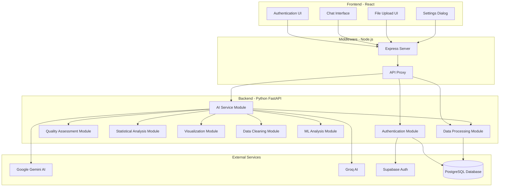

---

## Experiment 3

### Aim: To draw different levels for DFD

A DFD (Data Flow Diagram) is a graphical tool that visually maps out the flow of data through a system. Using standardized symbols, it shows where data enters the system, how it's transformed, where it's stored, and where it goes, helping to understand system functionality, identify inefficiencies, and improve processes.

### Level 0 DFD: Context Diagram

The context diagram provides the highest-level view of DataLix 2.0, showing the system as a single process and its interactions with external entities.

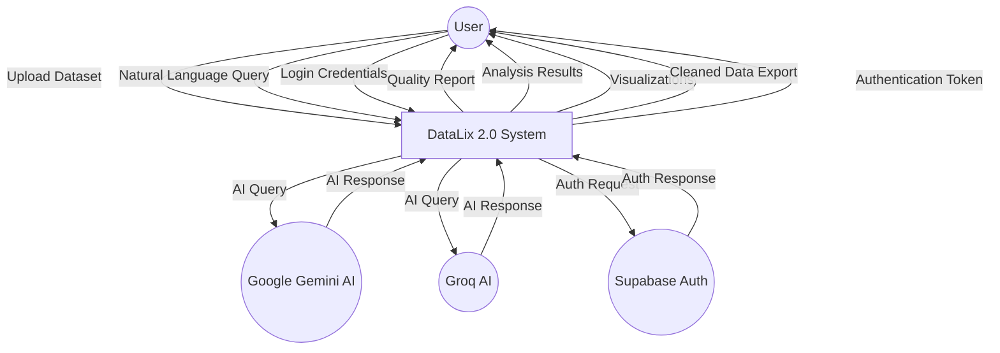

### Level 1 DFD: First Level Diagram

The Level 1 DFD breaks down the DataLix 2.0 system into its major subprocesses, showing the main functions and data flows.

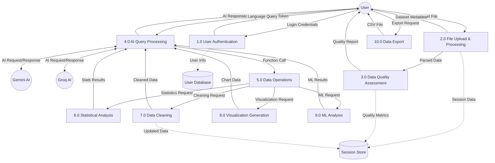

### Level 2 DFD: File Upload & Processing (Process 2.0)

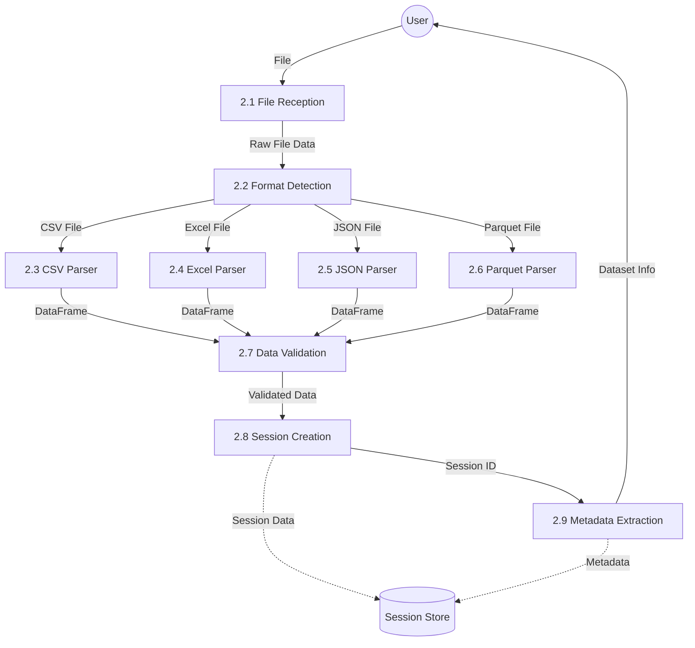

### Level 2 DFD: AI Query Processing (Process 4.0)

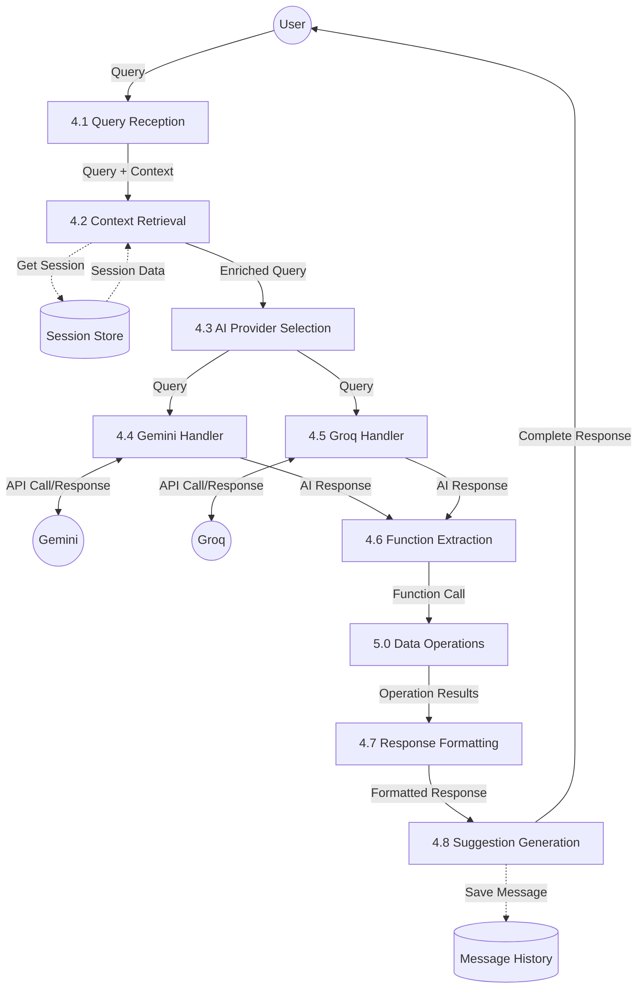

### Level 2 DFD: Data Cleaning (Process 7.0)

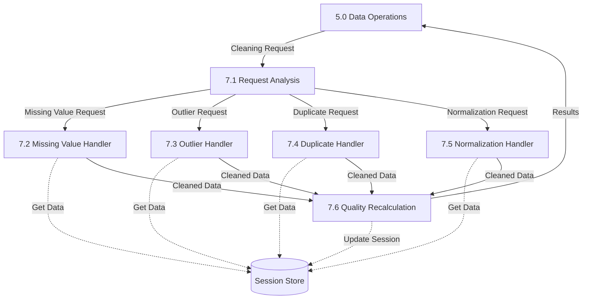

---

## Experiment 4

### Aim: To develop an ER diagram

An ER Diagram (Entity-Relationship Diagram) is a powerful tool to analyze and design the structure of a database. It shows the relationships between different entities and their attributes.

The DataLix 2.0 database keeps track of users, analysis sessions, messages, and dataset information with the following considerations:

- The system maintains user accounts with secure authentication (email, hashed password)
- Each user can have multiple analysis sessions
- Each session corresponds to one uploaded dataset with metadata
- Messages in each session track the conversation between user and AI
- Messages can contain chart data, data previews, and function calls
- Sessions store dataset information including file type, quality metrics, and metadata

### ER Diagram for DataLix 2.0

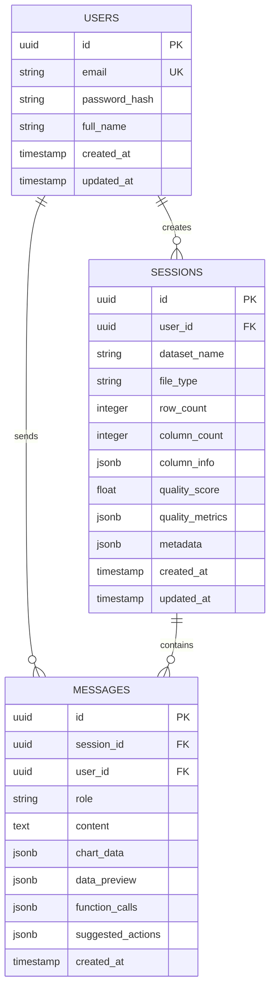

### Attributes

#### 1. Users
- **id** (Primary Key, UUID): Unique user identifier
- **email** (Unique): User email address for login
- **password_hash**: Bcrypt hashed password
- **full_name**: User's full name
- **created_at**: Account creation timestamp
- **updated_at**: Last update timestamp

#### 2. Sessions
- **id** (Primary Key, UUID): Unique session identifier
- **user_id** (Foreign Key): References Users table
- **dataset_name**: Name of uploaded dataset
- **file_type**: Type of file (csv, excel, json, parquet)
- **row_count**: Number of rows in dataset
- **column_count**: Number of columns in dataset
- **column_info** (JSONB): Column names, types, and statistics
- **quality_score**: Overall data quality score (0-100)
- **quality_metrics** (JSONB): Detailed quality metrics
- **metadata** (JSONB): Additional session information
- **created_at**: Session creation timestamp
- **updated_at**: Last update timestamp

#### 3. Messages
- **id** (Primary Key, UUID): Unique message identifier
- **session_id** (Foreign Key): References Sessions table
- **user_id** (Foreign Key): References Users table
- **role**: Message role (user, assistant, system)
- **content**: Text content of message
- **chart_data** (JSONB): Plotly chart specifications
- **data_preview** (JSONB): Dataset preview tables
- **function_calls** (JSONB): AI function calls made
- **suggested_actions** (JSONB): Suggested next actions
- **created_at**: Message timestamp

### Relationships

**User to Sessions:**
- One user can create many sessions (1:N)
- Each session belongs to one user

**User to Messages:**
- One user can send many messages (1:N)
- Each message is sent by one user

**Session to Messages:**
- One session can contain many messages (1:N)
- Each message belongs to one session

**Cascade Rules:**
- Deleting a user deletes all their sessions and messages
- Deleting a session deletes all its messages
- Messages maintain foreign key constraints

---

## Experiment 5

### Aim: To draw a use case diagram

A Use Case Diagram is a visual representation that illustrates the interactions between users (actors) and a system. It captures the functional requirements, showing how different users engage with various use cases within the system.

### Actors in DataLix 2.0

**Primary Actors:**
- **User**: Data analysts, business users, researchers, students who upload datasets and perform analysis
- **Administrator**: System admin who monitors platform usage and manages users
- **AI System**: External AI providers (Gemini, Groq) that process queries

### Use Cases

**User Use Cases:**
- Register Account
- Login to System
- Upload Dataset (CSV, Excel, JSON, Parquet)
- View Data Quality Score
- Ask Natural Language Question
- Clean Missing Values
- Remove Outliers
- Remove Duplicates
- Normalize Data
- View Statistical Analysis
- Generate Visualization
- Run ML Analysis
- Export Cleaned Data
- View Suggested Actions
- Change Settings (Theme, AI Provider)
- View Example Datasets
- Logout

**Administrator Use Cases:**
- Monitor System Usage
- View User Analytics
- Manage User Accounts
- View System Logs
- Generate Reports

**System Use Cases:**
- Process AI Query
- Calculate Quality Score
- Detect Data Issues
- Generate Recommendations

### Use Case Diagram

```mermaid
flowchart TB
    subgraph DataLix2.0["DataLix 2.0 System"]
        Register[Register Account]
        Login[Login to System]
        Upload[Upload Dataset]
        Quality[View Data Quality]
        Query[Ask Natural Language Question]
        Clean[Clean Data]
        Stats[View Statistics]
        Viz[Generate Visualization]
        ML[Run ML Analysis]
        Export[Export Data]
        Settings[Change Settings]
        Examples[View Example Datasets]
        
        ProcessAI[Process AI Query]
        CalcQuality[Calculate Quality Score]
        DetectIssues[Detect Data Issues]
        GenRec[Generate Recommendations]
        
        Monitor[Monitor System Usage]
        Analytics[View User Analytics]
        ManageUsers[Manage User Accounts]
        Logs[View System Logs]
        Reports[Generate Reports]
        
        Upload -.->|include| CalcQuality
        Upload -.->|include| DetectIssues
        DetectIssues -.->|include| GenRec
        
        Query -.->|include| ProcessAI
        Clean -.->|include| CalcQuality
        Stats -.->|include| ProcessAI
        Viz -.->|include| ProcessAI
        ML -.->|include| ProcessAI
    end
    
    User((User))
    Admin((Administrator))
    AISystem((AI System))
    
    User --> Register
    User --> Login
    User --> Upload
    User --> Quality
    User --> Query
    User --> Clean
    User --> Stats
    User --> Viz
    User --> ML
    User --> Export
    User --> Settings
    User --> Examples
    
    Admin --> Monitor
    Admin --> Analytics
    Admin --> ManageUsers
    Admin --> Logs
    Admin --> Reports
    
    ProcessAI <--> AISystem
    
    style DataLix2.0 fill:#f0f0f0,stroke:#333,stroke-width:2px
```

### Use Case Relationships

**Include Relationships (<<include>>):**
- Upload Dataset **includes** Calculate Quality Score
- Upload Dataset **includes** Detect Data Issues
- Detect Data Issues **includes** Generate Recommendations
- Ask Question **includes** Process AI Query
- Clean Data **includes** Recalculate Quality Score
- All AI-powered operations **include** Process AI Query

**Extend Relationships (<<extend>>):**
- View Suggested Actions **extends** Any AI Response
- Download Chart **extends** Generate Visualization
- View Data Preview **extends** View Statistics

---

## Experiment 6

### Aim: To draw sequence diagrams and collaboration diagrams

### Sequence Diagram 1: User Registration and Dataset Upload

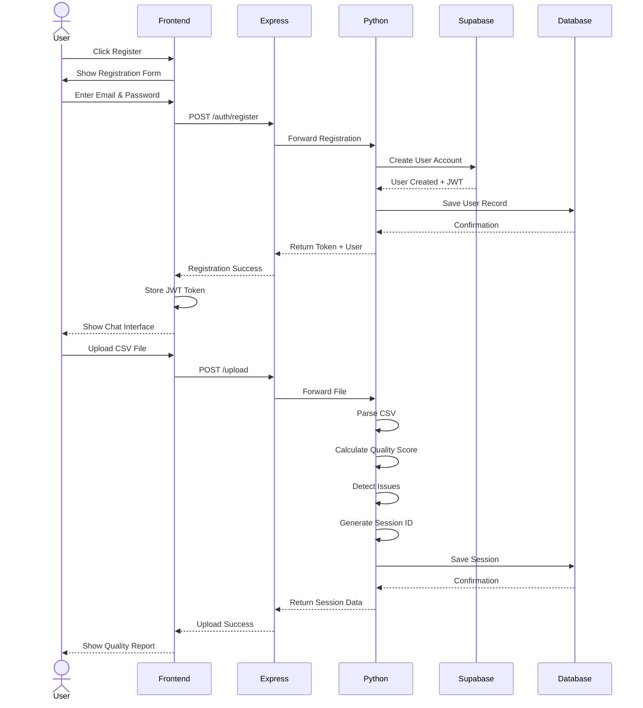

### Sequence Diagram 2: AI-Powered Data Analysis Query

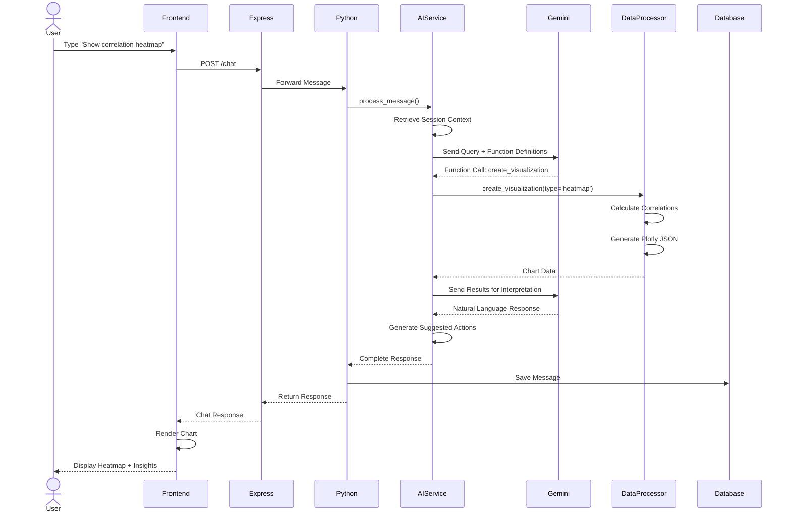

### Sequence Diagram 3: Data Cleaning Operation

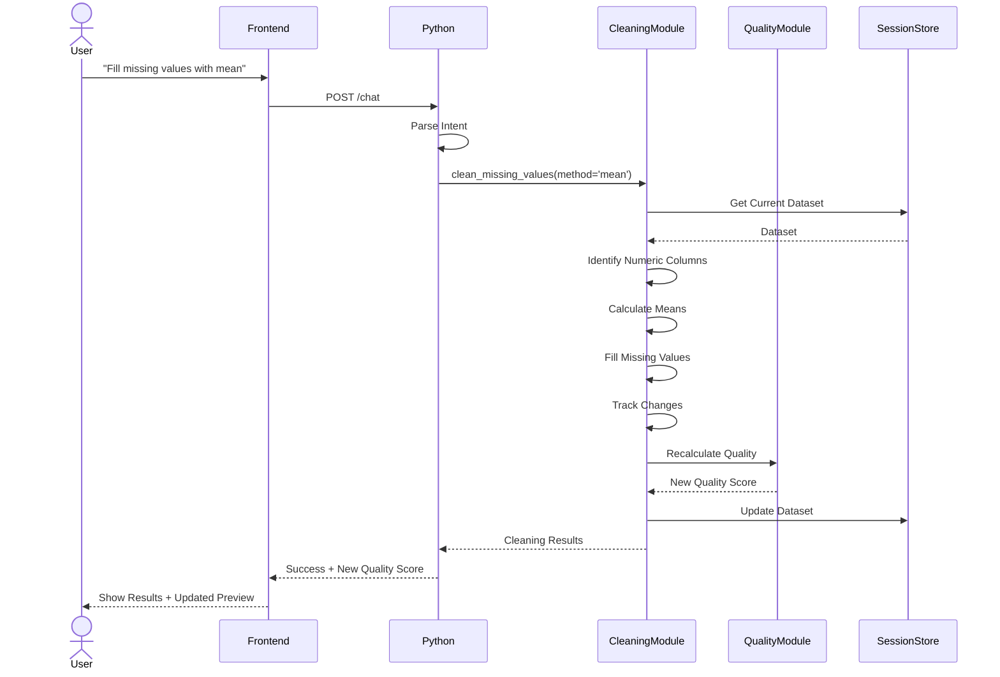

### Collaboration Diagram 1: File Upload Flow

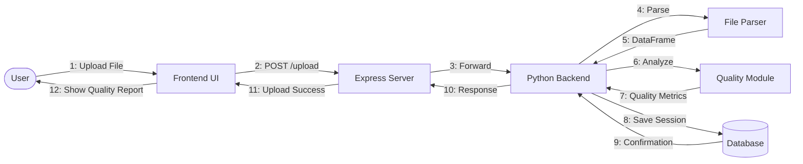

### Collaboration Diagram 2: AI Query Processing

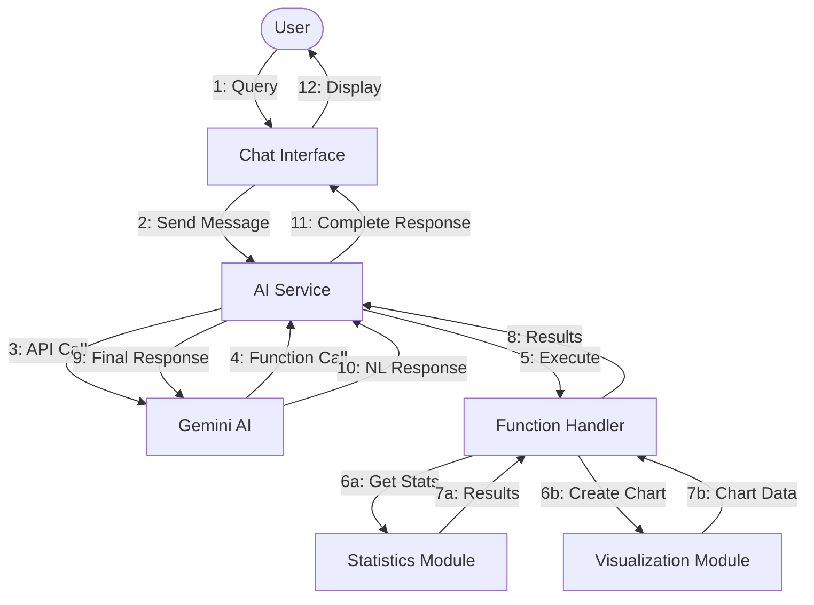

### Collaboration Diagram 3: Data Cleaning with Quality Update

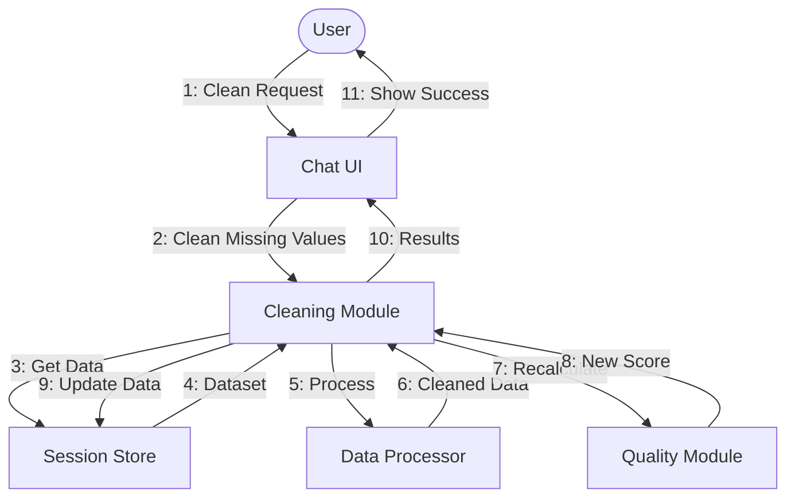

---

## Experiment 7

### Aim: To draw a class diagram

A class diagram visually represents the structure of a system by showing its classes, attributes, methods, and the relationships between them.

### Class Diagram for DataLix 2.0

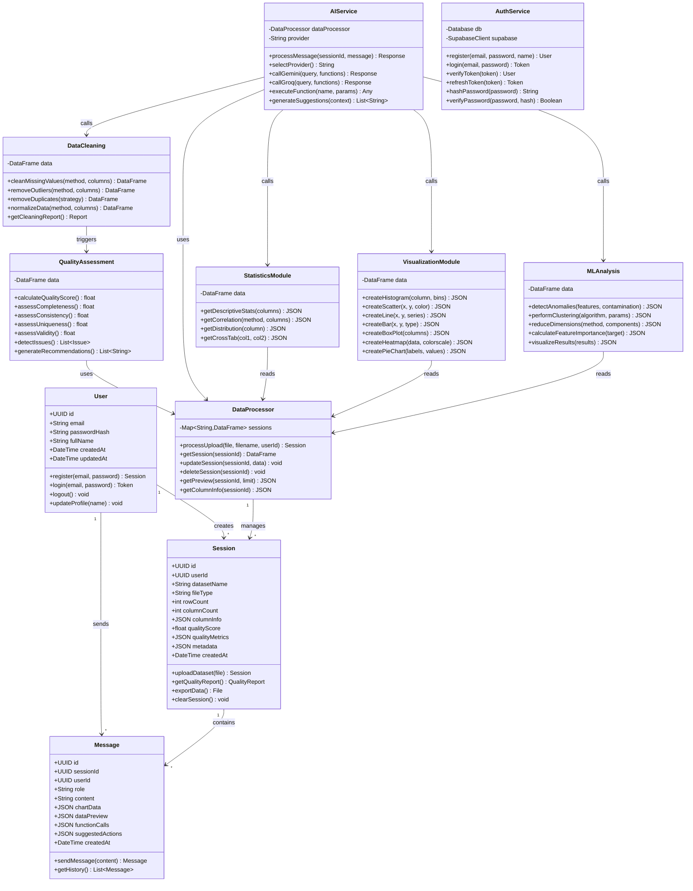

### Class Descriptions

**User Class:**
- Represents system users
- Manages authentication and profile
- Has relationships with sessions and messages

**Session Class:**
- Represents analysis sessions
- Stores dataset metadata and quality metrics
- Links users to their uploaded datasets

**Message Class:**
- Stores conversation history
- Contains text, charts, previews, and suggestions
- Links to both user and session

**DataProcessor Class:**
- Core data management
- Handles file parsing and session storage
- Provides data access to other modules

**QualityAssessment Class:**
- Calculates quality scores
- Detects data issues
- Generates recommendations

**AIService Class:**
- Orchestrates AI interactions
- Routes to Gemini or Groq
- Executes function calls
- Generates suggestions

**DataCleaning Class:**
- Implements cleaning operations
- Handles missing values, outliers, duplicates
- Normalizes data

**StatisticsModule Class:**
- Calculates descriptive statistics
- Computes correlations
- Analyzes distributions

**VisualizationModule Class:**
- Creates Plotly chart specifications
- Supports multiple chart types
- Returns JSON for frontend rendering

**MLAnalysis Class:**
- Implements ML algorithms
- Anomaly detection, clustering, dimensionality reduction
- Feature importance calculation

**AuthService Class:**
- Handles user authentication
- Integrates with Supabase
- Manages JWT tokens and password hashing

---

## Experiment 8

### Aim: To draw a Gantt chart and Network diagram

### Gantt Chart - DataLix 2.0 Development Timeline

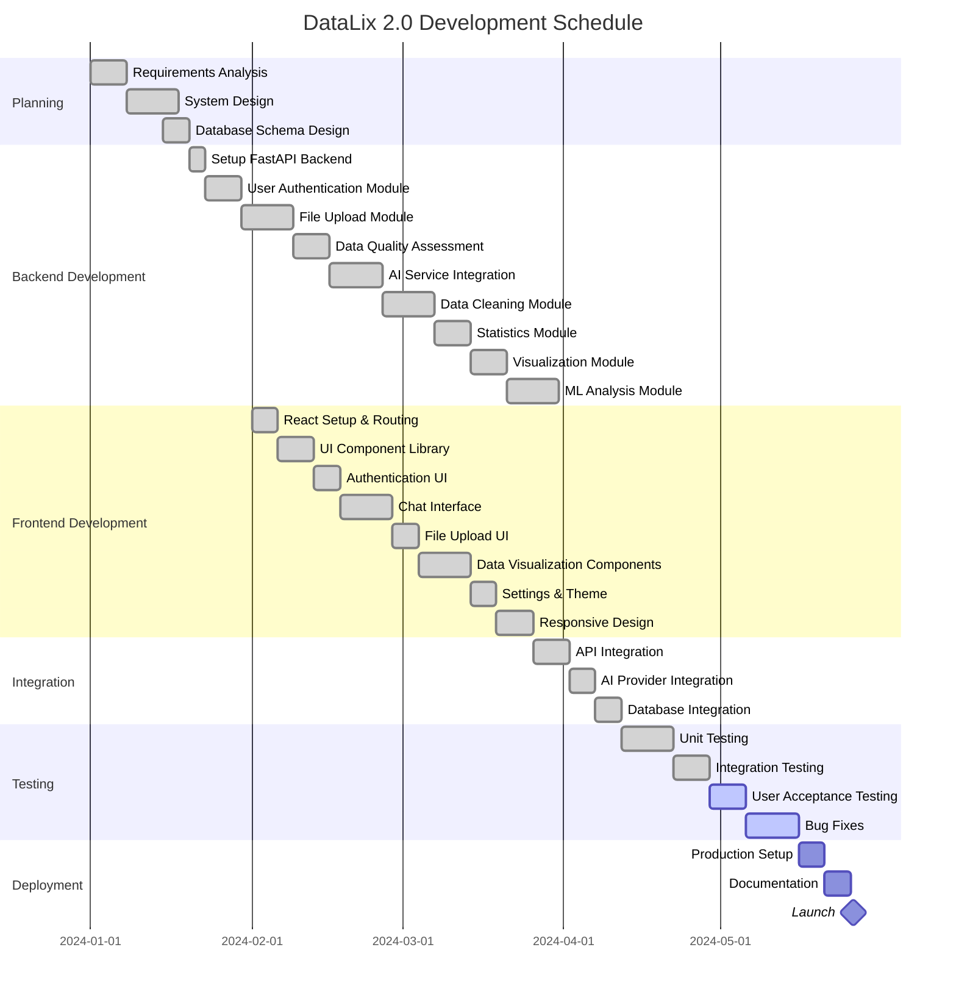

### Network Diagram - DataLix 2.0 Task Dependencies

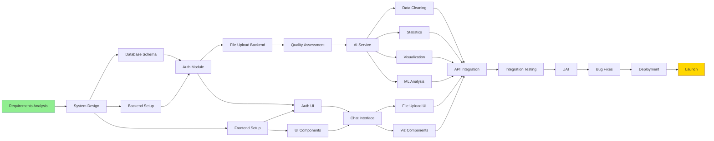

### Critical Path

The critical path for DataLix 2.0 development:
1. Requirements Analysis → System Design → Backend Setup → File Upload → Quality Assessment → AI Service → Data Operations → API Integration → Testing → Deployment

**Total Duration**: Approximately 5 months (150 days)

**Milestones**:
- ✅ Backend Core Complete: Week 8
- ✅ Frontend Core Complete: Week 10
- ✅ Integration Complete: Week 14
- 🔄 Testing Complete: Week 18
- 🎯 Launch: Week 20

---

## Experiment 9

### Aim: To draw a Structured Chart

A Structure Chart represents the hierarchical structure of modules, breaking down the system into functional modules and describing their relationships.

### Structured Chart for DataLix 2.0

```mermaid
graph TB
    Main[DataLix 2.0 Main System]
    
    Main --> Auth[Authentication Controller]
    Main --> Upload[Upload Controller]
    Main --> Chat[Chat Controller]
    Main --> Export[Export Controller]
    
    Auth --> AuthUI[Auth UI Module]
    Auth --> AuthAPI[Auth API Module]
    AuthAPI --> Supabase[Supabase Integration]
    AuthAPI --> JWT[JWT Manager]
    AuthAPI --> Password[Password Hasher]
    
    Upload --> UploadUI[Upload UI Module]
    Upload --> FileProc[File Processor]
    FileProc --> CSVParser[CSV Parser]
    FileProc --> ExcelParser[Excel Parser]
    FileProc --> JSONParser[JSON Parser]
    FileProc --> ParquetParser[Parquet Parser]
    
    FileProc --> Quality[Quality Assessor]
    Quality --> Completeness[Completeness Checker]
    Quality --> Consistency[Consistency Checker]
    Quality --> Uniqueness[Uniqueness Checker]
    Quality --> Validity[Validity Checker]
    
    Chat --> ChatUI[Chat UI Module]
    Chat --> AIRouter[AI Router]
    AIRouter --> GeminiHandler[Gemini Handler]
    AIRouter --> GroqHandler[Groq Handler]
    
    AIRouter --> FunctionExec[Function Executor]
    FunctionExec --> StatsFunc[Statistics Functions]
    FunctionExec --> CleanFunc[Cleaning Functions]
    FunctionExec --> VizFunc[Visualization Functions]
    FunctionExec --> MLFunc[ML Functions]
    
    StatsFunc --> DescStats[Descriptive Stats]
    StatsFunc --> Correlation[Correlation]
    StatsFunc --> Distribution[Distribution]
    
    CleanFunc --> MissingVal[Missing Value Handler]
    CleanFunc --> OutlierDet[Outlier Detector]
    CleanFunc --> DupRemove[Duplicate Remover]
    CleanFunc --> Normalize[Normalizer]
    
    VizFunc --> ChartGen[Chart Generator]
    ChartGen --> Histogram[Histogram]
    ChartGen --> Scatter[Scatter Plot]
    ChartGen --> Line[Line Chart]
    ChartGen --> Bar[Bar Chart]
    ChartGen --> Heatmap[Heatmap]
    
    MLFunc --> Anomaly[Anomaly Detector]
    MLFunc --> Cluster[Clustering]
    MLFunc --> DimReduce[Dimensionality Reduction]
    MLFunc --> FeatImp[Feature Importance]
    
    Export --> ExportUI[Export UI Module]
    Export --> ExportProc[Export Processor]
    ExportProc --> CSVExport[CSV Exporter]
    ExportProc --> DownloadMgr[Download Manager]
    
    style Main fill:#4CAF50,color:#fff
    style Auth fill:#2196F3,color:#fff
    style Upload fill:#FF9800,color:#fff
    style Chat fill:#9C27B0,color:#fff
    style Export fill:#F44336,color:#fff
```

### Module Hierarchy Levels

**Level 0 - Main Controller:**
- DataLix 2.0 Main System (Entry Point)

**Level 1 - Primary Controllers:**
- Authentication Controller
- Upload Controller
- Chat Controller
- Export Controller

**Level 2 - Sub-Controllers:**
- UI Modules for each controller
- API/Processing Modules

**Level 3 - Specialized Modules:**
- Parser modules for different file types
- Quality assessment components
- AI provider handlers
- Function executors

**Level 4 - Atomic Operations:**
- Individual statistics calculations
- Specific cleaning operations
- Chart type generators
- ML algorithms

### Data Flow Indicators

- **Control Flow** (solid lines): Module invocation hierarchy
- **Data Flow** (implied): Data passes from parent to child modules
- **Library Modules** (reusable): Password Hasher, JWT Manager, Chart Generator

---

## Experiment 10

### Aim: Development of Design Document

A Software Design Document provides a description of a software product in terms of architecture with various components and specified functionality.

---

# Software Design Document: DataLix 2.0

## 1. Introduction

This document outlines the design and architecture for DataLix 2.0, an AI-powered data analysis platform that democratizes data science through conversational AI.

### 1.1 Purpose

The purpose of this document is to provide a detailed overview of DataLix 2.0's design, including its architecture, modules, database schema, and technical specifications. It serves as a guide for development, implementation, and maintenance teams.

### 1.2 Scope

DataLix 2.0 covers the following key areas:

- **File Management**: Upload and processing of CSV, Excel, JSON, Parquet files
- **Data Quality Assessment**: Automated scoring and issue detection
- **AI Conversation**: Natural language query processing using Gemini and Groq
- **Data Cleaning**: Missing value handling, outlier removal, duplicate detection, normalization
- **Statistical Analysis**: Descriptive statistics, correlation analysis, distributions
- **Data Visualization**: Interactive charts using Plotly (histograms, scatter, line, bar, heatmap, etc.)
- **Machine Learning**: Anomaly detection, clustering, dimensionality reduction, feature importance
- **User Authentication**: Secure login with Supabase and JWT tokens
- **Data Export**: CSV export functionality

## 2. System Architecture

DataLix 2.0 adopts a modern three-tier architecture with clear separation of concerns.

### 2.1 High-Level Architecture

The system consists of the following main layers:

**Presentation Layer:**
- React 18+ with TypeScript
- Wouter for client-side routing
- Zustand for state management
- Shadcn/ui + Radix UI components
- Tailwind CSS for styling
- Plotly.js for visualizations

**Application Layer (Dual Backend):**
- **Node.js/Express**: API gateway, proxy middleware, Vite dev server
- **Python/FastAPI**: Business logic, AI integration, data processing, ML operations

**Data Layer:**
- **PostgreSQL Database**: User data, sessions, messages (via Neon)
- **In-Memory Storage**: Active dataset storage in Python backend
- **External Services**: Google Gemini AI, Groq AI, Supabase Auth

### 2.2 Module Breakdown

**Frontend Modules:**
- Authentication Module (Login/Register UI)
- Chat Interface Module (Message display, input, suggested actions)
- File Upload Module (Drag-drop, file validation, progress)
- Data Preview Module (Table display, quality metrics)
- Visualization Module (Chart rendering)
- Settings Module (Theme, AI provider selection)

**Backend Modules:**
- Authentication Module (User management, JWT tokens)
- File Processing Module (Multi-format parsers)
- Data Quality Module (Quality scoring, issue detection)
- AI Service Module (Gemini/Groq integration, function calling)
- Data Cleaning Module (Missing values, outliers, duplicates, normalization)
- Statistics Module (Descriptive stats, correlations)
- Visualization Module (Plotly chart generation)
- ML Analysis Module (Anomaly detection, clustering, PCA, t-SNE)
- Export Module (CSV generation, download management)

## 3. Data Design

### 3.1 Entity-Relationship Model

**Entities:**
- Users (id, email, password_hash, full_name)
- Sessions (id, user_id, dataset_name, file_type, quality_score, metadata)
- Messages (id, session_id, user_id, role, content, chart_data, data_preview)

**Relationships:**
- User 1:N Sessions
- User 1:N Messages
- Session 1:N Messages

### 3.2 Database Schema

**Primary Tables:**
```sql
users (
  id UUID PRIMARY KEY,
  email VARCHAR UNIQUE,
  password_hash VARCHAR,
  full_name VARCHAR,
  created_at TIMESTAMP,
  updated_at TIMESTAMP
)

sessions (
  id UUID PRIMARY KEY,
  user_id UUID REFERENCES users(id),
  dataset_name VARCHAR,
  file_type VARCHAR,
  quality_score FLOAT,
  metadata JSONB,
  created_at TIMESTAMP
)

messages (
  id UUID PRIMARY KEY,
  session_id UUID REFERENCES sessions(id),
  user_id UUID REFERENCES users(id),
  role VARCHAR,
  content TEXT,
  chart_data JSONB,
  data_preview JSONB,
  created_at TIMESTAMP
)
```

### 3.3 In-Memory Data Structure

```python
sessions = {
  "session_id": {
    "data": pandas.DataFrame,
    "metadata": {
      "filename": str,
      "file_type": str,
      "upload_time": datetime,
      "quality_score": float
    }
  }
}
```

## 4. User Interface Design

### 4.1 Design System

**Typography:**
- Interface: Inter font family
- Data/Code: JetBrains Mono
- Hierarchy: text-2xl → text-lg → text-base → text-sm → text-xs

**Color System:**
- Supports light and dark modes
- HSL-based color variables
- Semantic color tokens (primary, accent, destructive, etc.)

**Layout:**
- Chat-centered interface (ChatGPT style)
- Maximum width constraints for readability
- Responsive grid system

### 4.2 User Roles

- **Authenticated User**: Access to all data analysis features
- **Guest User**: No access (login required)
- **Administrator**: System monitoring and user management (future)

### 4.3 Key Screens

1. **Authentication Page**: Login and registration forms
2. **Chat Interface**: Main analysis workspace with message feed and input
3. **Upload Dialog**: File selection and upload with progress
4. **Settings Dialog**: Theme and AI provider preferences
5. **Example Datasets Dialog**: Pre-loaded dataset selection

## 5. Technical Specifications

### 5.1 Technology Stack

**Frontend:**
- React 18+ with TypeScript
- Vite (build tool)
- Wouter (routing)
- Zustand (state management)
- TanStack React Query (data fetching)
- Shadcn/ui + Radix UI (components)
- Tailwind CSS (styling)
- Plotly.js (charts)
- React Markdown (message rendering)

**Backend:**
- Node.js 20 with Express (middleware layer)
- Python 3.11 with FastAPI (application backend)
- Uvicorn (ASGI server)

**Data Processing:**
- Pandas (DataFrames)
- NumPy (numerical operations)
- Scikit-learn (ML algorithms)
- Plotly Python (chart generation)

**AI Integration:**
- Google Gemini AI (google-generativeai)
- Groq (groq-sdk)

**Database:**
- PostgreSQL 15+ (via Neon)
- Drizzle ORM (TypeScript)

**Authentication:**
- Supabase Auth (primary)
- Bcrypt (password hashing)
- JWT (token management)

### 5.2 API Architecture

**RESTful Endpoints:**
- POST /auth/register - User registration
- POST /auth/login - User login
- POST /upload - File upload
- POST /chat - AI query processing
- POST /statistics - Statistical analysis
- POST /correlation - Correlation analysis
- POST /visualization - Chart creation
- POST /clean/missing - Missing value handling
- POST /clean/outliers - Outlier removal
- POST /clean/duplicates - Duplicate removal
- POST /clean/normalize - Data normalization
- POST /ml-analysis - ML operations
- GET /export - Data export

### 5.3 AI Function Calling

**Supported Functions:**
- get_statistics(columns)
- get_correlation(method, columns)
- create_visualization(chart_type, parameters)
- clean_missing_values(method, columns)
- remove_outliers(method, columns)
- remove_duplicates(strategy)
- normalize_data(method, columns)
- run_ml_analysis(analysis_type, parameters)
- export_data(format)
- get_data_preview(rows)
- get_column_info()

## 6. Security Considerations

### 6.1 Authentication & Authorization

- JWT token-based authentication
- Bcrypt password hashing (10+ rounds)
- Role-based access control (RBAC)
- Protected API routes requiring valid tokens

### 6.2 Data Security

- HTTPS/TLS for data in transit
- Environment variables for API keys
- Session isolation (no cross-user data access)
- Input validation and sanitization
- SQL injection prevention (parameterized queries)
- XSS protection (React automatic escaping)

### 6.3 Privacy

- User data stored securely in PostgreSQL
- Session data isolated per user
- No data sharing between users
- Optional Supabase Auth for additional security layer

## 7. Performance Considerations

### 7.1 Optimization Strategies

- **Frontend**: Code splitting, lazy loading, React Query caching
- **Backend**: In-memory session storage for fast access
- **Database**: Indexed queries, connection pooling
- **AI**: Request caching, provider failover

### 7.2 Scalability

- Stateless API design for horizontal scaling
- In-memory sessions (trade-off: speed vs persistence)
- Database-backed session metadata for recovery
- Support for load balancing (future)

## 8. Error Handling

### 8.1 Error Categories

- File Upload Errors (invalid format, size limit)
- AI Provider Errors (API failures, rate limits)
- Database Errors (connection issues, constraint violations)
- Data Processing Errors (invalid operations, missing data)
- Authentication Errors (invalid credentials, expired tokens)

### 8.2 Error Recovery

- AI provider auto-failover (Gemini ↔ Groq)
- Retry logic for transient failures
- Clear error messages to users
- Error logging for debugging

## 9. Testing Strategy

### 9.1 Testing Levels

- **Unit Tests**: Individual module functions
- **Integration Tests**: API endpoints, database operations
- **End-to-End Tests**: Complete user workflows
- **User Acceptance Tests**: Real user scenarios

### 9.2 Test Coverage

- Target: 80%+ code coverage
- Critical paths: Authentication, file upload, AI query processing
- Edge cases: Large files, malformed data, network failures

## 10. Deployment Architecture

### 10.1 Environment

- **Platform**: Replit
- **Workflow**: npm run dev (starts both Node.js and Python servers)
- **Node.js Server**: Port 3000 (frontend + proxy)
- **Python Server**: Port 8001 (backend API)

### 10.2 Environment Variables

```
# AI Providers
GEMINI_API_KEY=<google-gemini-key>
GROQ_API_KEY=<groq-key>

# Authentication
SUPABASE_URL=<supabase-url>
SUPABASE_ANON_KEY=<anon-key>
SUPABASE_SERVICE_ROLE_KEY=<service-key>

# Database
DATABASE_URL=<postgresql-connection-string>

# Frontend (optional)
VITE_SUPABASE_URL=<supabase-url>
VITE_SUPABASE_ANON_KEY=<anon-key>
```

### 10.3 Production Considerations

- HTTPS enforcement
- Rate limiting
- Request validation
- Monitoring and logging
- Database backups
- Caching strategies

## 11. Future Enhancements

### 11.1 Planned Features

- More ML algorithms (regression, classification)
- Advanced data transformations (pivot, melt, groupby)
- Multiple file export formats (Excel, JSON, Parquet)
- Session history and persistence
- Collaborative analysis sessions
- Dashboard creation and templates
- Database connectivity (PostgreSQL, MySQL, MongoDB)
- Cloud storage integration (S3, GCS, Azure)
- Scheduled reports
- API for programmatic access

### 11.2 Advanced AI Features

- Custom model fine-tuning
- Automated insight generation
- Predictive analytics
- Natural language data queries (SQL generation)
- Automated report writing

### 11.3 Enterprise Features

- Team workspaces
- User management and permissions
- Audit logs
- SSO integration
- On-premise deployment
- Advanced security features

## 12. Conclusion

This design document provides a comprehensive blueprint for DataLix 2.0, an AI-powered data analysis platform. The architecture emphasizes:

- **Accessibility**: Natural language interface for all skill levels
- **Intelligence**: AI-driven insights and recommendations
- **Flexibility**: Multiple file formats and analysis techniques
- **Security**: Robust authentication and data protection
- **Scalability**: Modern architecture ready for growth

The design enables rapid development and deployment while maintaining code quality, security, and user experience standards.

## 13. Appendix

### 13.1 Glossary

- **DataFrame**: Tabular data structure (pandas)
- **JWT**: JSON Web Token for authentication
- **JSONB**: JSON Binary storage in PostgreSQL
- **Plotly**: Interactive visualization library
- **Zustand**: Lightweight state management
- **Drizzle ORM**: TypeScript ORM for SQL databases
- **Session**: Analysis session for uploaded dataset
- **Quality Score**: 0-100 metric for data quality

### 13.2 References

- React Documentation: https://react.dev
- FastAPI Documentation: https://fastapi.tiangolo.com
- Pandas Documentation: https://pandas.pydata.org
- Plotly Documentation: https://plotly.com
- Gemini API: https://ai.google.dev
- Groq Documentation: https://console.groq.com

### 13.3 Contact Information

For further inquiries about DataLix 2.0, please contact the development team.

---

**Document Version**: 1.0  
**Last Updated**: 2025-01-13  
**Project**: DataLix 2.0 - AI-Powered Data Analysis Platform  
**Status**: Production Ready (MVP)

---

**END OF SOFTWARE ENGINEERING DOCUMENT**
