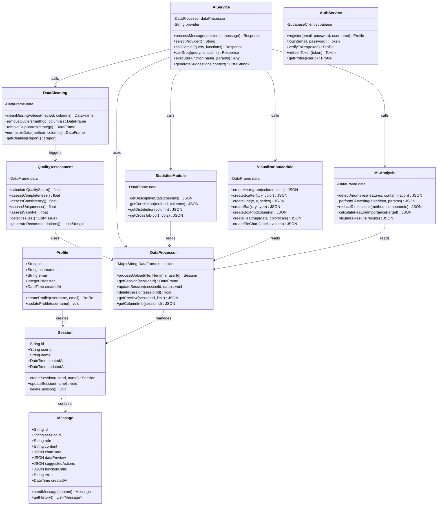

# Software Engineering Document
## DataLix 2.0 - AI-Powered Data Analysis Platform
### Updated Database Schema Version

---

## Database Schema Updates

### Current Database Structure

The DataLix 2.0 application uses PostgreSQL (via Neon) with the following three core tables:

#### 1. Profiles Table

Stores user profile information (linked to Supabase auth.users):

```sql
profiles (
  id VARCHAR PRIMARY KEY,
  username TEXT NOT NULL UNIQUE,
  email TEXT NOT NULL UNIQUE,
  is_master INTEGER NOT NULL DEFAULT 0,
  created_at TIMESTAMP DEFAULT NOW() NOT NULL
)
```

**Field Descriptions:**
- `id`: Unique identifier for the user (VARCHAR, primary key from Supabase auth)
- `username`: Unique username for the user profile
- `email`: User's email address (must be unique)
- `is_master`: Flag indicating master/admin privileges (0 = regular user, 1 = master)
- `created_at`: Timestamp when the profile was created

**Note:** Authentication is handled by Supabase. Password hashing and user authentication logic are managed externally. The profiles table only stores public profile information.

#### 2. Sessions Table

Stores analysis session metadata for uploaded datasets:

```sql
sessions (
  id VARCHAR PRIMARY KEY DEFAULT gen_random_uuid(),
  user_id VARCHAR NOT NULL REFERENCES profiles(id),
  name TEXT,
  created_at TIMESTAMP DEFAULT NOW() NOT NULL,
  updated_at TIMESTAMP DEFAULT NOW() NOT NULL
)
```

**Field Descriptions:**
- `id`: Auto-generated UUID for the session
- `user_id`: Foreign key reference to profiles table
- `name`: Optional name/description for the session
- `created_at`: Timestamp when the session was created
- `updated_at`: Timestamp when the session was last updated

**Note:** The actual dataset data (CSV content, quality metrics, etc.) is stored in-memory for performance, while the sessions table maintains metadata for persistence and recovery.

#### 3. Messages Table

Stores conversation history between users and the AI assistant:

```sql
messages (
  id VARCHAR PRIMARY KEY DEFAULT gen_random_uuid(),
  session_id VARCHAR NOT NULL REFERENCES sessions(id),
  role TEXT NOT NULL,
  content TEXT NOT NULL,
  chart_data JSONB,
  data_preview JSONB,
  suggested_actions JSONB,
  function_calls JSONB,
  error TEXT,
  created_at TIMESTAMP DEFAULT NOW() NOT NULL
)
```

**Field Descriptions:**
- `id`: Auto-generated UUID for the message
- `session_id`: Foreign key reference to sessions table
- `role`: Message sender ('user' | 'assistant')
- `content`: The text content of the message
- `chart_data`: Optional Plotly chart JSON data
- `data_preview`: Optional table preview data (columns, rows, metadata)
- `suggested_actions`: Optional array of suggested next actions
- `function_calls`: Optional array of AI function calls executed
- `error`: Optional error message if the operation failed
- `created_at`: Timestamp when the message was created

### Database Relationships

```
profiles (1) ──────< (N) sessions
                       │
                       │
                       └──< (N) messages
```

**Relationships:**
- One profile can have many sessions (1:N)
- One session can have many messages (1:N)
- Messages are linked to sessions only (not directly to profiles)

### TypeScript Schema Definitions

The schema is defined using Drizzle ORM in `shared/schema.ts`:

```typescript
// Profiles table
export const profiles = pgTable("profiles", {
  id: varchar("id").primaryKey(),
  username: text("username").notNull().unique(),
  email: text("email").notNull().unique(),
  isMaster: integer("is_master").notNull().default(0),
  createdAt: timestamp("created_at").defaultNow().notNull(),
});

// Sessions table
export const sessions = pgTable("sessions", {
  id: varchar("id").primaryKey().default(sql`gen_random_uuid()`),
  userId: varchar("user_id").notNull().references(() => profiles.id),
  name: text("name"),
  createdAt: timestamp("created_at").defaultNow().notNull(),
  updatedAt: timestamp("updated_at").defaultNow().notNull(),
});

// Messages table
export const messages = pgTable("messages", {
  id: varchar("id").primaryKey().default(sql`gen_random_uuid()`),
  sessionId: varchar("session_id").notNull().references(() => sessions.id),
  role: text("role").notNull(),
  content: text("content").notNull(),
  chartData: jsonb("chart_data"),
  dataPreview: jsonb("data_preview"),
  suggestedActions: jsonb("suggested_actions"),
  functionCalls: jsonb("function_calls"),
  error: text("error"),
  createdAt: timestamp("created_at").defaultNow().notNull(),
});
```

### Type Exports

```typescript
// Profile types
export type Profile = typeof profiles.$inferSelect;
export type InsertProfile = z.infer<typeof insertProfileSchema>;

// Legacy aliases for backward compatibility
export type User = Profile;
export type InsertUser = InsertProfile;

// Session types
export type Session = typeof sessions.$inferSelect;
export type InsertSession = z.infer<typeof insertSessionSchema>;

// Message types
export type Message = typeof messages.$inferSelect;
export type InsertMessage = z.infer<typeof insertMessageSchema>;
```

---

## Updated Class Diagram



---

## Updated Module Descriptions

### 1.1 User Authentication Module

The authentication module integrates with Supabase for secure user management:

- **User Registration**: Create new profiles with username and email (password handled by Supabase)
- **User Login**: Authenticate via Supabase and sync profile data
- **Profile Management**: Maintain user profile information in the profiles table
- **Session Management**: Track user sessions with JWT tokens from Supabase
- **Access Control**: Check master privileges for admin features
- **Supabase Integration**: Primary authentication through Supabase Auth

### 1.10 Session Management Module

Manages analysis sessions with improved structure:

- **Session Creation**: Create new sessions linked to user profiles
- **Session Naming**: Optional naming for better organization
- **Session Storage**: Metadata persisted in database, data in-memory
- **Session Retrieval**: Access session data across requests
- **Session Updates**: Track last modification time
- **Session Cleanup**: Remove inactive sessions and their messages
- **Multi-Session Support**: Multiple concurrent sessions per user

### 1.4 AI Conversation Module

Enhanced message storage with rich data:

- **Message Persistence**: All messages stored in database
- **Chart Embedding**: Store Plotly chart data with messages
- **Data Previews**: Attach table previews to AI responses
- **Suggested Actions**: Store contextual action suggestions
- **Function Tracking**: Record which functions were called
- **Error Handling**: Store error messages for failed operations
- **Conversation History**: Retrieve complete message history per session

---

## Key Architecture Changes

### In-Memory vs Database Storage

**Database (Persistent):**
- User profiles
- Session metadata (id, name, timestamps)
- Complete message history with rich data

**In-Memory (Performance):**
- Actual dataset content (pandas DataFrames)
- Quality assessment results
- Computed statistics
- Temporary processing results

**Benefits:**
- Fast data operations (in-memory)
- Persistent conversation history (database)
- Session recovery capability
- Efficient memory usage

### Data Flow Example

1. **User uploads CSV file**
   - Session record created in database
   - DataFrame stored in-memory
   - Quality assessment computed and cached

2. **User asks AI question**
   - User message stored in database
   - AI processes using in-memory DataFrame
   - Assistant message stored with chart_data/data_preview

3. **User closes and reopens app**
   - Session metadata retrieved from database
   - Message history loaded from database
   - Dataset may need re-upload (in-memory lost)

---

## Runtime Type Interfaces

Beyond database schema, the application uses these TypeScript interfaces:

```typescript
// Chat message with all rich data
export interface ChatMessage {
  id: string;
  role: 'user' | 'assistant';
  content: string;
  timestamp: Date;
  chartData?: PlotlyChartData;
  dataPreview?: DataPreview;
  qualityScore?: DataQuality;
  suggestedActions?: SuggestedAction[];
  functionCalls?: string[];
  error?: boolean;
}

// Data preview structure
export interface DataPreview {
  columns: ColumnInfo[];
  rows: Record<string, any>[];
  totalRows: number;
  totalColumns: number;
  fileName?: string;
}

// Quality assessment
export interface DataQuality {
  overallScore: number;
  completeness: number;
  consistency: number;
  uniqueness: number;
  validity: number;
  columnMetrics: ColumnMetric[];
  issues: QualityIssue[];
  recommendations: string[];
}

// Plotly chart data
export interface PlotlyChartData {
  data: any[];
  layout: any;
  config?: any;
}
```

---

## API Request/Response Schemas

### Upload Response
```typescript
export interface UploadResponse {
  sessionId: string;
  datasetInfo: {
    rows: number;
    columns: number;
    sizeMb: number;
    columnNames: string[];
    columnTypes: Record<string, string>;
  };
  quality: DataQuality;
  preview: DataPreview;
  issues: QualityIssue[];
}
```

### Chat Request/Response
```typescript
export interface ChatRequest {
  sessionId: string;
  message: string;
}

export interface ChatResponse {
  message: string;
  functionCalls?: string[];
  results?: any;
  dataPreview?: DataPreview;
  chartData?: PlotlyChartData;
  suggestedActions?: SuggestedAction[];
  qualityScore?: number;
}
```

---

## Database Migration Notes

### From Legacy Schema to Current Schema

**Changes Made:**
1. ✅ Renamed `users` table to `profiles`
2. ✅ Simplified sessions table (removed dataset-specific fields)
3. ✅ Enhanced messages table with JSONB fields
4. ✅ Removed `user_id` from messages (use session relationship)
5. ✅ Added `is_master` field for admin privileges
6. ✅ Added `username` field for display names
7. ✅ Moved dataset data to in-memory storage

**Migration Path:**
- If migrating from old schema, run Drizzle migrations
- Export existing data before schema changes
- Re-upload datasets after migration (in-memory reset)
- Message history preserved if schema compatible

---

## Summary

The updated database schema for DataLix 2.0:
- Uses **3 tables**: profiles, sessions, messages
- Leverages **Supabase** for authentication
- Stores **metadata** in database, **data** in-memory
- Provides **rich message history** with charts and previews
- Enables **session recovery** and **conversation persistence**
- Supports **master/admin privileges** via `is_master` flag
- Uses **Drizzle ORM** for type-safe database operations

This hybrid approach optimizes for both performance (in-memory data operations) and persistence (database message history and session metadata).
